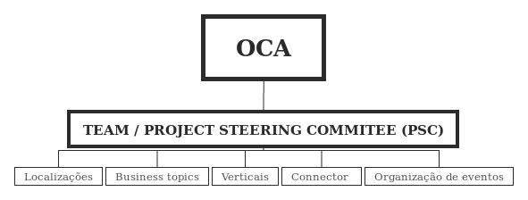

Comunidade
==========
O que tornou o Odoo grande?

OCA? WTF?
---------

.. code::

    # -*- coding: utf-8 -*-
    # © 2016 Daniel Torres <daniel.torres@grupoidealcare.com.br>
    #  License AGPL-3 - See http://www.gnu.org/licenses/agpl-3.0.html
    # Import odoo community association
    from oca import indio

The Odoo Community Association
------------------------------

Associação da comunidade Odoo, ou OCA, é uma organização sem fins lucrativos
cuja a missão é promover o uso generalizado do Odoo e apoiar o desenvolvimento
colaborativo de recursos do Odoo.

- Apoio finaneiro;
- Suporte legal e organizacional a comunidade codigo aberto odoo;
- 99,999999999999999% independente dos interesses da Odoo SA;

OCA: Objetivos
--------------

- Promover a colaboraçao
- Coordernar
- Defender os interesses
- Divulgar o Odoo
- Facilitar: Sinergia, colaboraçao e levantar fundos
- Roadmaps, implementaçao

OCA: Organizaçao
----------------

OCA: Links importantes
-----------------------

- OCA TWITTER; @odoocommunity @OCA_Bot
- OCA lists: https://odoo-community.org/groups
- OCA Membership: https://odoo-community.org/page/Membership
- OCA lists: https://odoo-community.org/groups
- Blog: https://odoo-community.org/blog/oca-news-1

Odoo no Brasil
--------------

- Localização Brasileira é mantida pela OCA;
- Código: https://github.com/oca/l10n-brazil
- Lista: https://www.odoo-community.org/groups/brazil-12

.. Como contribuir?
.. ================

.. .. slide:: Vim contribuir!!!!!
   :class: fullscreen
   :inline-contents: True

..   .. figure:: images/jump.jpg
      :class: fill

Como contribuir?
----------------

    Talk is cheap, show me the code!

-- Linus Torvalds

.. nextslide::

1. Entenda as regras
    - Odoo: https://github.com/odoo/odoo/wiki/Contributing
    - OCA: https://odoo-community.org/page/review
2. Siga as regras
3. Faça pelos outros para que eles façam por voce;

"Gaste o seu tempo de espera revendo as contribuições dos outros "[...] As coisas mais interessantes que aprendi sobre programação em geral e especificamente em Odoo era por ter o meu código revisto ou revendo o código de outras pessoas."
-- Holger Brunn, membro da comunidade.
