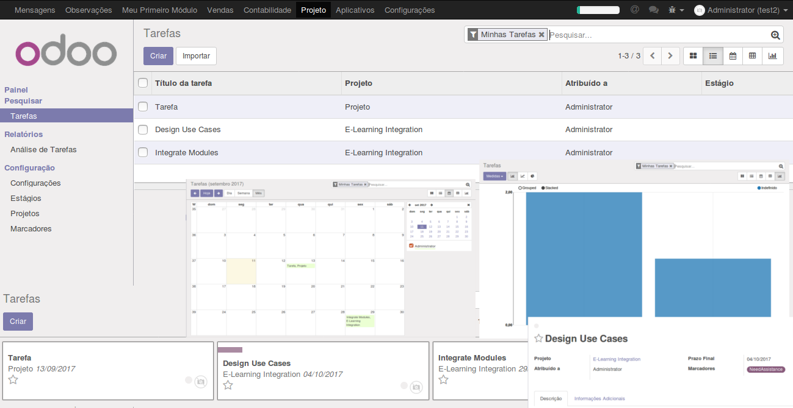
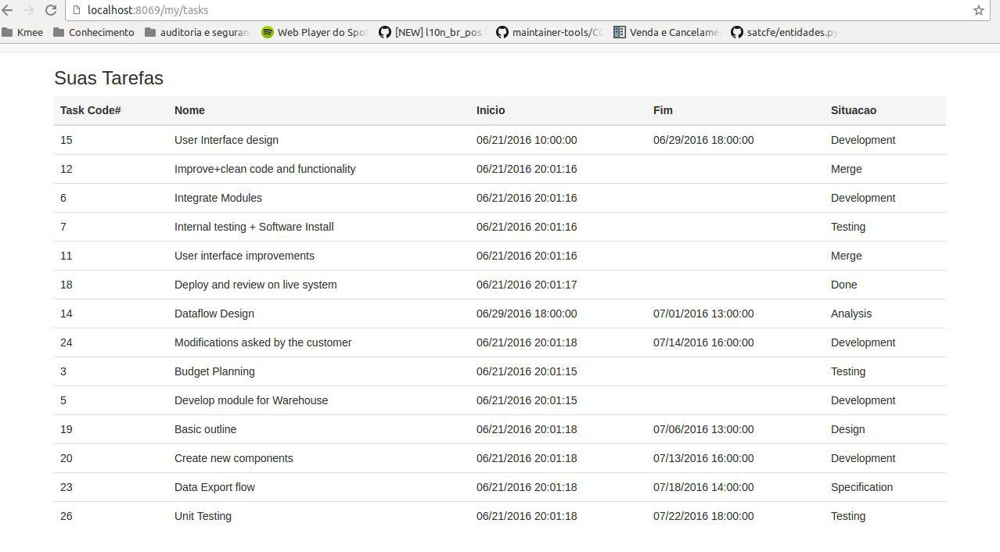

Desenvolvendo com Odoo
======================

Desenvolvendo com Odoo
----------------------

- É uma ótima plataforma para se desenvolver;
- O core do framework é muito bom, te ajuda muito!
- Permite a contrução de aplicações do Zero;
- E adapatar aplicativos existentes para as suas necessidades através de um mecanismo de extensão modular.

.. nextslide::

- A Versão 8 trouxe uma gama de novas possibilidades ao adicionar recursos para se desenvolver sites.
- O software e bem grande e é normal os ingressantes se sentirem um pouco perdidos.
- Durante anos, os desenvolvedores Odoo aprenderam seu ofício atraves da leitura do código fonte do core.
- Apesar de ser uma tecnica efetiva, e um processo demorado e voce acaba ficando sujeito a muitos erros.

Backend Views
-------------

Backend Code: Models
--------------------

.. code-block:: python

    class ProjectTask(models.Model):

        name = fields.Char('Name')
        date_start = fields.Date('Date Start')
        date_end = fields.Date('Date End')
        stage_id = fields.One2many('Stage', 'project.task.stage')
        ...

        @api.onchange('user_id')
        def _onchange_user(self):
            if self.user_id:
                self.date_start = fields.Datetime.now()

        @api.multi
        def copy(self, default=None):
            ...

        @api.constrains('date_start', 'date_end')
        def _check_dates(self):
            if any(self.filtered(lambda task: task.date_start and
            task.date_end and task.date_start > task.date_end)):
                return ValidationError(
                _('Error ! Task starting date must be'
                  'lower than its ending date.'))

Backend Code: Views
-------------------

.. code-block:: xml

     <record id="act_project_project_2_project_task_all" model="ir.actions.act_window">
            <field name="name">Tasks</field>
            <field name="res_model">project.task</field>
            <field name="view_mode">kanban,tree,form,calendar,pivot,graph</field>
      </record>

      <menuitem action="action_view_task" id="menu_action_view_task" parent="project.menu_project_management" sequence="5"/>

      <record id="view_task_tree2" model="ir.ui.view">
            <field name="name">project.task.tree</field>
            <field name="model">project.task</field>
            <field eval="2" name="priority"/>
            <field name="arch" type="xml">
                <tree decoration-bf="message_needaction==True" decoration-danger="date_deadline and (date_deadline&lt;current_date)" string="Tasks">
                    <field name="message_needaction" invisible="1"/>
                    <field name="sequence" invisible="not context.get('seq_visible', False)"/>
                    <field name="name"/>
                    <field name="project_id" invisible="context.get('user_invisible', False)"/>
                    <field name="user_id" invisible="context.get('user_invisible', False)"/>
                    <field name="planned_hours" invisible="context.get('set_visible',False)" groups="project.group_time_work_estimation_tasks"/>
                    <field name="date_deadline" invisible="context.get('deadline_visible',True)"/>
                    <field name="stage_id" invisible="context.get('set_visible',False)"/>
                </tree>
            </field>
        </record>
      [...]

Frontend Views
--------------

- Responsivo

Front-End Code: Rotas
---------------------

.. code-block:: python

    class website_user_tasks(http.Controller):

    def _prepare_tasks(self, **kw):
        invoices = request.env['project.task'].search([
            ('user_id', '=', request.uid)
        ])
        return invoices

    @http.route(['/my/tasks'], type='http', auth="user", website=True)
    def tasks(self, **post):
        tasks = {'tasks': self._prepare_tasks()}
        return request.website.render("website_user_tasks.tasks_only", tasks)

Front-End Code: Views
---------------------

.. code-block:: xml

    <template id="tasks" name="Minhas Tarefas">
        <h3 >Suas Tarefas</h3>
        <t t-if="not tasks">
            
Nao existem tarefas disponiveis.

        </t>
        <t t-if="tasks">
            

                <table class="table table-hover o_my_status_table">
                    <thead>
                      <tr class="active">
                        <th>Task Code#</th>
                        <th>Nome</th>
                        <th>Inicio</th>
                        <th>Fim</th>
                        <th>Situacao</th>
                      </tr>
                    </thead>
                    <t t-foreach="tasks" t-as="task">
                        <tr>
                            <td></td>
                            <td></td>
                            <td></td>
                            <td></td>
                            <td></td>

                        </tr>
                    </t>
                </table>
            

        </t>
    </template>
