Relatórios
==========

Relatórios
----------

Um dos principais recursos do framework Odoo é a geração de relatórios. Relatórios em Odoo são arquivos gerados automáticamente contendo dados de um recordset.

reporting-engine
----------------

Há módulos da OCA que auxiliam na criação e manutenção de relatórios mais eficientemente.

Para instalar esses módulos, basta adicionar o seguinte ao arquivo buildout.cfg e executar novamente o buildout (não se esqueça da flag -N):

.. code-block:: shell

    [odoo]
    ...
    addons = ...
        git git@github.com:OCA/reporting-engine.git parts/reporting-engine 10.0

report_py3o
-----------

O módulo report_py3o permite montar relatórios em pdf de forma mais fácil e rápida através de tabelas no libreoffice writer.

Para poder utilizá-lo é necessário instalar algumas dependências, o que pode ser feito adicionando-as ao buildout e executando-o novamente:

.. code-block:: shell

    [sources]
    ...
    py3o.template = hg https://bitbucket.org/faide/py3o.template branch=default
    py3o.formats = hg https://bitbucket.org/faide/py3o.formats branch=default

    [odoo]
    ...
    eggs = ...
        py3o.template
        py3o.formats

    [versions]
    ...
    py3o.template =
    py3o.formats =

Relatório de livros selecionados
--------------------------------

Vamos montar um relatório básico para livros, contendo apenas o nome do livro, seus autores,
a editora e a data de lançamento.

Para usar um relatório em py3o, devemos instalar o módulo report_py3o. Podemos fazê-lo apenas
adicionando-o como dependência do nosso módulo . Assim, ao atualizar o módulo a dependência será
instalada. Em __manifest__.py adicione:

.. code-block:: py

    {
    ...
        'depends':[ ..., 'report_py3o'],
    ...
    }

.. nextslide::

Por convenção, os arquivos de configuração de relatórios devem estar em um diretório chamado report.

.. code-block:: shell

    $ mkdir report

.. nextslide::

Dentro da pasta report, crie o arquivo de configuração do relatório report_library_book_py3o.xml:

.. code-block:: xml

    <odoo>

        <record id="report_library_book_py3o" model="ir.actions.report.xml">
            <field name="name">Resumo do Livro</field>
            <field name="type">ir.actions.report.xml</field>
            <field name="model">library.book</field>
            <field name="report_name">Relatório de livros</field>
            <field name="report_type">py3o</field>
            <field name="py3o_filetype">odt</field> <!-- extensão do arquivo de saída -->
            <field name="py3o_is_local_fusion" eval="1"/> <!-- não usa servidor de arquivos -->
            <field name="module">library_book</field>
        </record>

    </odoo>

.. nextslide::

Ainda em report_library_book_py3o.xml, adicione o relatório ao menu Print:

.. code-block:: xml

    <record id="report_library_book_py3o_print_action" model="ir.values">
        <field name="key">action</field>
        <field name="key2">client_print_multi</field>
        <field name="model">library.book</field>
        <field name="name">Relatório de livros</field>
        <field name="value" eval="'ir.actions.report.xml,'+str(report_library_book_py3o)"/>
    </record>

.. nextslide::

Precisamos também criar um arquivo no formato odt com o libreoffice.
Crie o arquivo report_library_book.odt, na pasta data do módulo library_book:

.. code-block:: shell

    $ mkdir data
    $ cd data
    $ touch report_library_book.odt
    $ libreoffice --writer report_library_book.odt

.. nextslide::

Na linguagem do py3o, o nosso recordset é chamado de objects. Para acessar seus campos, temos de inserir campos de
usuário no libreoffice, o que pode ser feito clicando em Inserir->Campo->Outros campos...(Ctrl+F2):

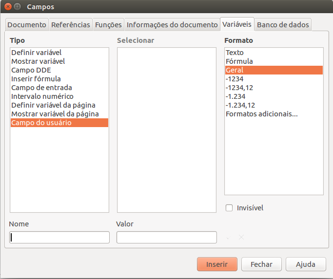

.. nextslide::

Insira o campo name:

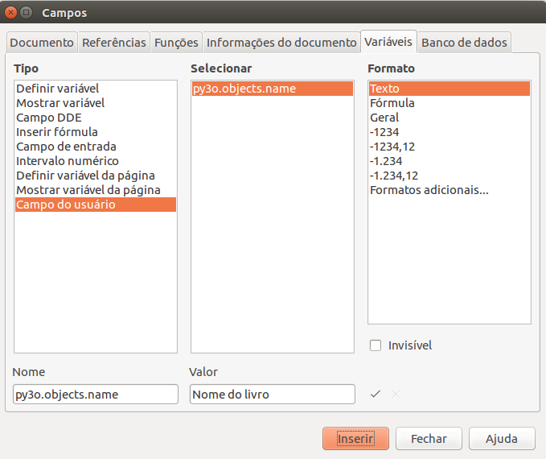

.. nextslide::

Salve o arquivo. Vamos inserir o arquivo nas configurações de relatório (report_library_book_py3o.xml):

.. code-block:: xml

    <odoo>
        ...
        <record id="report_library_book_py3o" model="ir.actions.report.xml">
            ...
            <field name="py3o_template_fallback">data/report_library_book.odt</field>
        </record>
        ...
    </odoo>

.. nextslide::

Atualize o módulo library_book. Na view tree do library.book, ao selecionar um livro, o menu drop-down "Print" é mostrado.

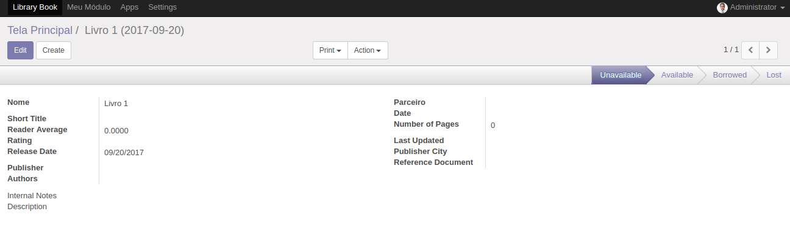

.. nextslide::

Clique em Print->Resumo do Livro. Um arquivo no formato odt será baixado, e deve ter o conteúdo seguinte:

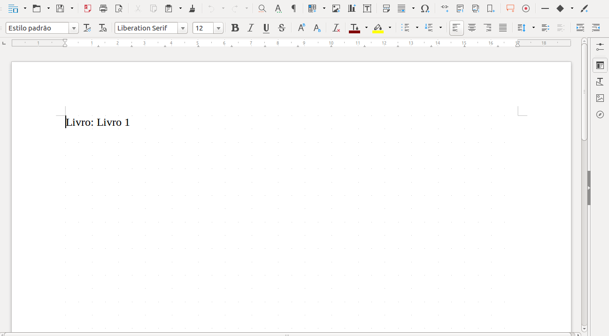

.. nextslide::

Vamos agora adicionar alguns dos outros campos no nosso arquivo de template odt. Para organizar uma posição padrão para os campos, vamos utilizar uma tabela:

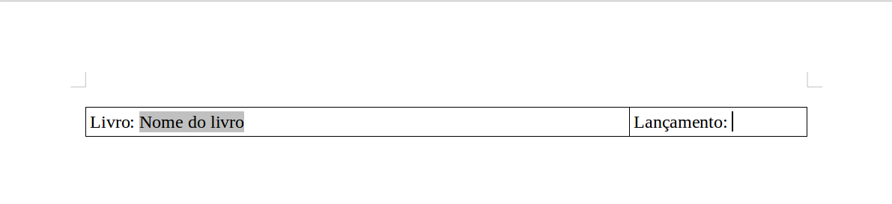

.. nextslide::

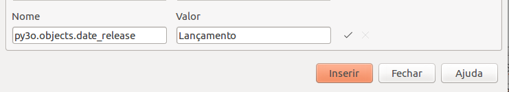

.. nextslide::

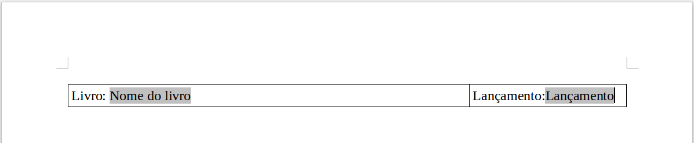

.. nextslide::

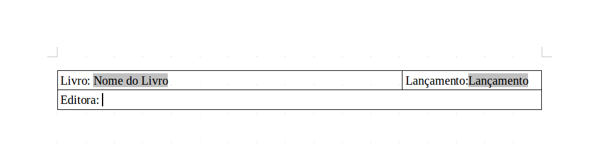

.. nextslide::

Como o nome da editora é um campo many2one, o valor de publisher_id é um recordset odoo.
Para imprimir o nome da editora é necessário buscar o nome no recordset:

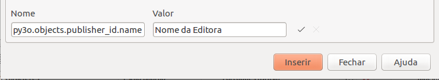

.. nextslide::

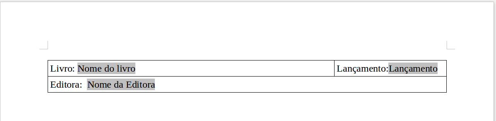

.. nextslide::

Vamos agora testar o que fizemos até agora. Salve o arquivo e na interface, vá até o form view de um dos livros e clique em Print->Resumo do Livro:

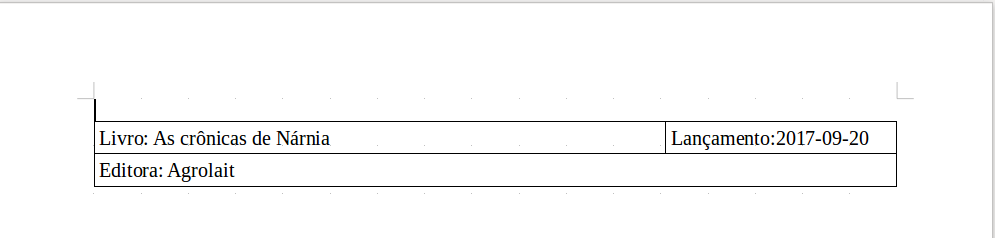

Estrutura for
-------------

Como um livro pode ter mais de um autor, vamos precisar de uma iteração for.

Insira uma nova linha abaixo da tabela, e nessa linha insira um hiperlink com Ctrl+K:

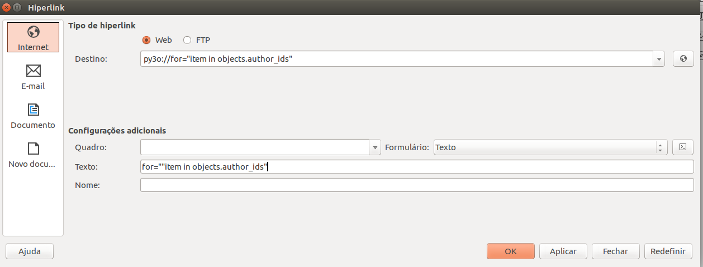

.. nextslide::

Insira mais duas linhas na tabela, e coloque mais um hiperlink na última linha da tabela:

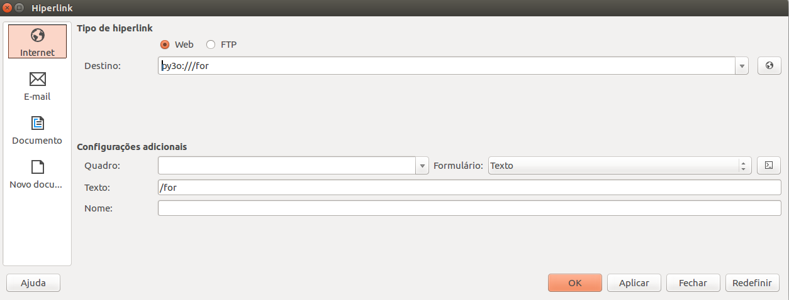

.. nextslide::

Na linha entre o início e o fim do for, coloque o campo nome do autor:

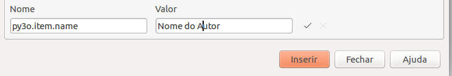

Repare que não utilizamos objects, e sim item, por estar dentro da iteração.

.. nextslide::

Para maior clareza do relatório, insira uma linha acima do início do for e escreva autores:

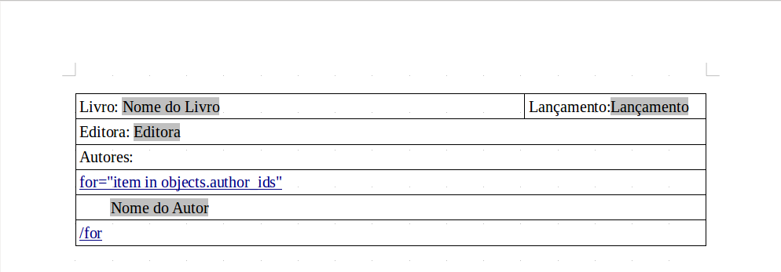

.. nextslide::

Vamos ver como fica o resumo gerado:

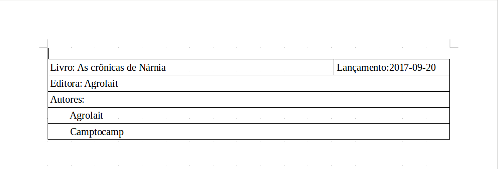

Estrutura if
------------

Alguns livros possuem um título abreviado, que é interessante constar no resumo. Como essa
abreviação pode existir ou não, usaremos uma estrutura if.

Acima de "Editora" insira 3 linhas na tabela. Faremos uma estrutura com hiperlinks bem parecida
com a do for, somente mudando o seguinte no hiperlink de início:

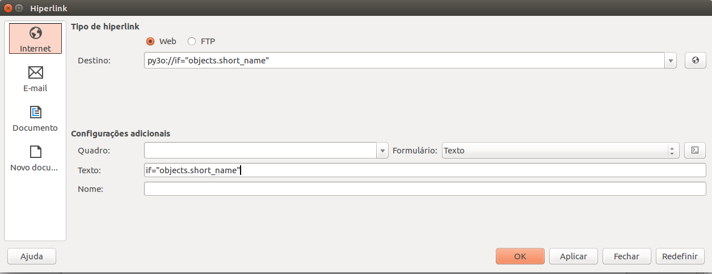

.. nextslide::

E no hiperlink de fim:

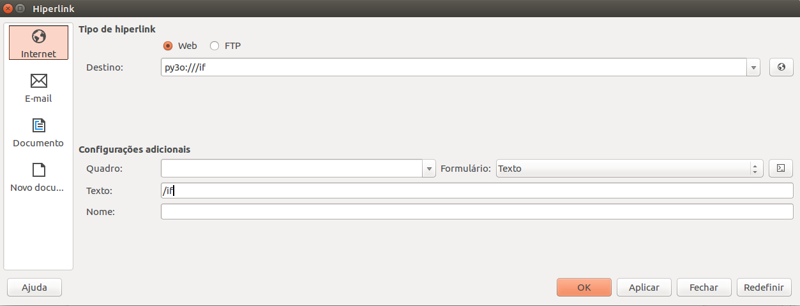

Insira agora o campo short_name entre o início e o fim do if:

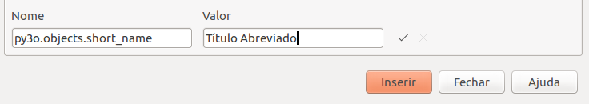

.. nextslide::

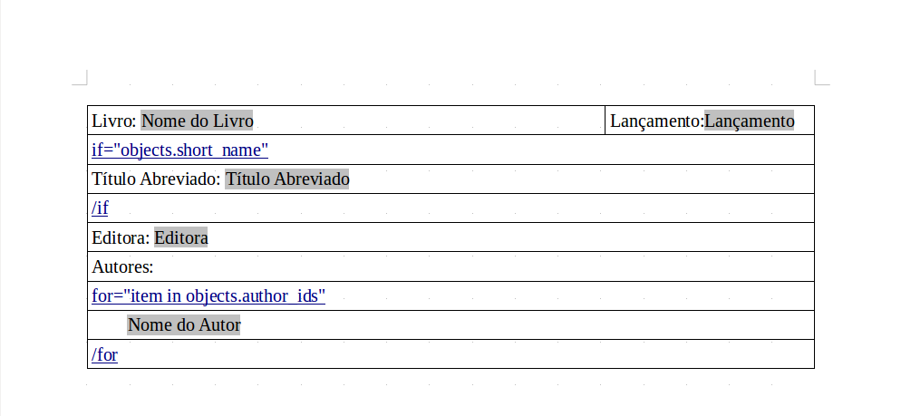

.. nextslide::

Se não houver um título abreviado, o resumo gerado não mudará. Porém, se o campo short_name
for preenchido, o seguinte será impresso:

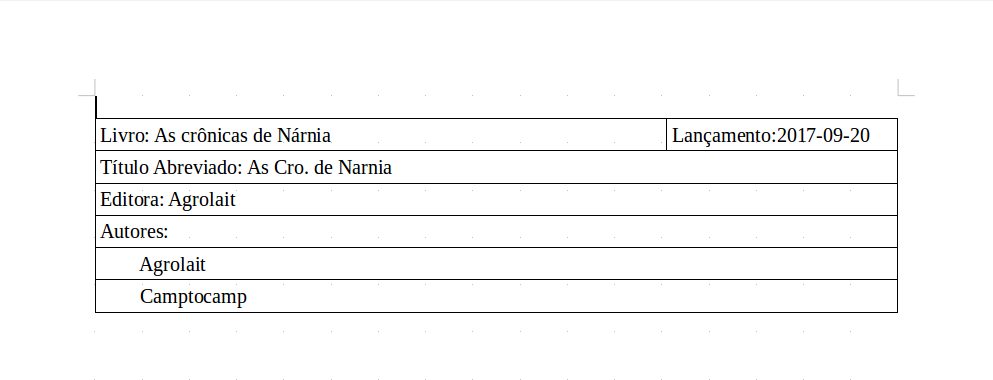

Concertando campos date
-----------------------

Você deve ter percebido que o campo da data de lançamento não está corretamente formatado.
Para formatar corretamente, temos que criar um campo novo no modelo library.book:

.. code-block:: python

    class LibraryBook(models.Model):
        _name='library.book'
        ...
        date_release_fmt = fields.Char(
            string=u'Data de lançamento formatada',
            compute='_compute_date_release_fmt',
        )

        @api.depends('date_release')
        def _compute_date_release_fmt(self):
            if self.date_release:
                date_str = self.date_release
                date_fmt = '%s/%s/%s' % (date_str[8:], date_str[5:7], date_str[:4])
                self.date_release_fmt = date_fmt

.. nextslide::

Depois é só substituir o campo date_release por date_release_fmt no template do relatório:

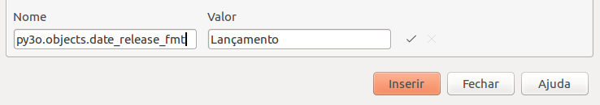

.. nextslide::

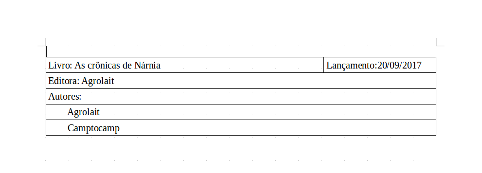

