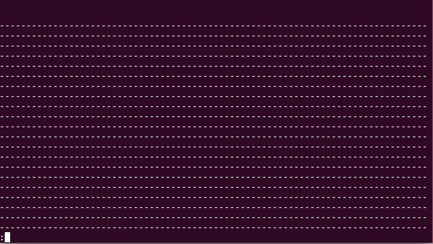
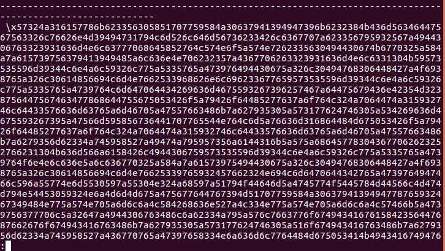

Armazenamento de arquivos
=========================

Arquivos binários
-----------------

No Odoo, existem dois tipos de armazenamento de arquivos: os arquivos binários e os anexos.
Os anexos são campos que podem ser declarados em qualquer modelo como um outro campo qualquer,
e assim como os outros campos do modelo, é armazenado no banco de dados.

.. nextslide::

Vamos ver um exemplo de arquivo armazenado no banco de dados. Adicione o campo arquivo ao modelo
library.book:

.. code-block:: python

    class LibraryBook(models.Model):
        _name = 'library.book'
        ...
        arquivo = fields.Binary(
            string=u'Adicionar arquivo',
        )

.. nextslide::

E adicione-o também na visão:

.. code-block:: xml

    <record id="library_book_view_form" model="ir.ui.view">
        ...
        <field name="arch" type="xml">
            <form>
            ...
                <group>
                    ...
                    <field name="ref_doc_id"/>
                    <field name="arquivo"/>
                </group>
            </form>
        </field>
    </record>

.. nextslide::

Atualize o módulo e no form do modelo library.book, adicione um arquivo.
Agora, no terminal, vamos fazer uma query no banco e ver o arquivo:

.. code-block:: shell

    $ psql nome-do-banco

.. code-block:: shell

    nome-do-banco=> select arquivo from library_book where arquivo is not null;

.. nextslide::

.. nextslide::

.. nextslide::

Anexos
------

O problema do campo binário é que, quando são adicionados arquivos muito grandes, armazenar
isso no banco de dados diminui muito sua performance, e pode deixar o sistema muito lento.

Para resolver esse problema, o Odoo tem uma forma alternativa de armazenar arquivos, os **anexos**.

Anexo (ir_attachment) é um modelo criado exclusivamente para armazenar arquivos. Sua vantagem
é o armazenamento de arquivos no disco, e sua manipulação por meio de funções python de manipulação
de arquivos.

O campo datas
-------------

O campo computado datas é implementado usando as funções **_file_read**, **_file_write** e **_file_delete**,
que podem ser sobreescritas para implementar outras formas de armazenamento.

.. code-block:: python

    # trecho de código do core do Odoo
    datas = fields.Binary(string='File Content', compute='_compute_datas', inverse='_inverse_datas')

**nota**: Perceba que o campo é computado sem a flag store=True, ou seja, não é armazenado em disco.

.. nextslide::

O campo description
-------------------

O campo description é um campo armazenado no banco de dados utilizado para indexação dos arquivos. Esse campo contêm partes da
informação do arquivo que o ORM consegue reconhecer, e usa esse campo para otimizar as consultas no banco de dados.

