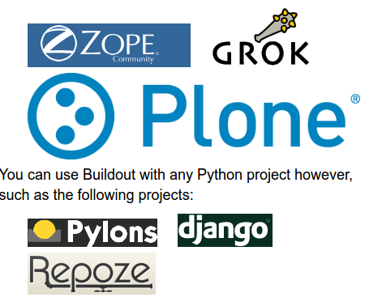

Setup ambiente de desenvolvimento
=================================

Pré requisitos:
---------------

- Para se desenvolver Odoo, é recomendável ambiente GNU/Linux;
- É recomendado utilizar a mesma distribuição e versão da produção: **Ubuntu 16.04 LTS**
- Conta no github: https://github.com

Dependencias:
-------------
.. to big

- GNU/Linux;
- PostgreSQL;
- Bibliotecas C;
- Python e Bibliotecas que estendem a stadard library;
- Outras dependências ( reports e outros );

Instalação:
-----------

1. Instalação das dependencias

.. code-block:: shell

	curl -s https://raw.githubusercontent.com/kmee/dependencias.odoo/master/install-dependencies.sh \
            | sudo bash

2. Instalação do postgres

.. code-block:: shell

	curl -s https://raw.githubusercontent.com/kmee/dependencias.odoo/master/install-postgresql.sh \
            | sudo bash

3. Permissão do postgres para o seu usuário

.. code-block:: shell

        curl -s https://raw.githubusercontent.com/kmee/dependencias.odoo/master/create-postgres-user.sh \
            | sudo bash

Configuração do ambiente de desenvolvimento
-------------------------------------------

Ambientes virtuais Python
-------------------------

- Python virtual environments, ou **virtualenv** são ambientes de trabalhos python isolados.
- Permitem aos desenvolvedores trabalharem com diferentes versões de bibliotecas python instaladas.
- É possivel criar quantos ambientes forem precisos;

`Documentação oficial <https://virtualenv.pypa.io/en/stable/>`_
Buildout                                                                                                                           
========                                                                                                                           
                                                                                                                                   
O que é?                                                                                                                           
--------                                                                                                                           
                                                                                                                                   
Buildout é um sistema de *build* baseado em Python para a criação, montagem e
implantação de aplicativos de com vários componentes.

Alguns dos quais não são necessáriamente baseados em Python.

Ele permite você criar uma "receita" e replicar o mesmo software posteriormente.

Quem?
-----

Odoo buildout recipe
--------------------

- Permite definir e rapidamente realizar o deploy de qualquer versão do Odoo.
- De ambientes de desenvolvimento a até automatização completa de ambientes de produção com integração continua.
- Uniformidade entre versões;
- Obtenção de modulos odoo de diferentes fontes: git, brz, svn etc;
- Capacidade de versionar tudo para repetibilidade;
- Gerenciamento da configuração do Odoo
- Empacotamento: Criação de pacotes para facil deploy em ambientes controlados.

Como funciona?
--------------

- Uma configuração pode extender outra e até alterar configurações já definidas
- Podemos definir variáveis para especificar configurações
- [versions] sessão padrão utilizada para versionar os pacores python
- Você pode gerenciar a configuração através de um sistema de controle de versão.

.. nextslide::

- O código fonte do odoo fica no diretório parts/subdiretório
- As dependencias python em eggs/
- O arquivo de configuração é criado na pasta etc/odoo.cfg
- Um script para inicialização do Odoo é criado em bin/start_odoo

Exercicio
---------

1. Crie um repositório privado no gitlab chamado: treinamento-odoo
2. Adicione pela interface o arquivo .gitignore e o arquivo README.md
3. Clone o repositório localmente
4. Acesse a pasta clonada
5. Criação de um ambiente virtual

.. code-block:: shell
    
    virtualenv .
    source bin/activate

6. Instalação do buildout

.. code-block:: shell

    pip install -U pip zc.buildout

Arquivo do buildout.cfg
-----------------------
7. Crie o arquivo de configuração buildout.cfg na pasta raiz, e insira o seguinte texto:

.. code-block:: python

    [buildout]
    parts = odoo
    
    extensions= mr.developer
    sources = sources
    auto-checkout = *
    
    [sources]
    anybox.recipe.odoo = git https://github.com/anybox/anybox.recipe.odoo.git branch=master
    
    
    [odoo]
    recipe = anybox.recipe.odoo:server
    version = git https://github.com/oca/ocb.git odoo 10.0 depth=1
    parts = local specific-parts/specific-addons

Executando o buidout
--------------------

8. Execute o buildout

.. code-block:: shell

    bin/buildout

O Recipe Odoo
-------------

Estrutura dos diretórios:
 1. bin/
 2. parts
 3. src
Arquivos gerados:
 1. etc/odoo.cfg
 2. upgrade.py

Executando o Odoo
-----------------

.. code-block:: shell

    bin/start_odoo

Adicionando parâmetros
---------------------- 

Edite o arquivo buildout.cfg e inclua no fim da receita do Odoo a linha:

.. code-block:: shell

    [odoo]
    ...
    
    options.passwd = admin

Executando buildout novamente
-----------------------------

O parametro -N é responsável por agilizar a re-execução do buildout, evitando que o mesmo busque novamente pacotes que ele já tem a versão mais nova.

.. code-block:: shell

     bin/buildout -N 

Adicionando novos repositósios
------------------------------
Adicione o trecho no arquivo buildout.cfg

.. code-block:: python

    [odoo]

    addons = git git@github.com:OCA/project.git parts/oca/project 10.0

Adionando uma dependencia python de um addon
--------------------------------------------

Se um modulo odoo precisa de um pacote python externo, você pode adiciona-lo na
sessão [odoo] e versiona-lo na sessão [versions] conforme:

.. code-block:: shell

    [buildout]
    ...
    versions = versions

    [odoo]
    ...
    eggs = pycorreios

    [versions]
    pycorreios = 0.1.1

Congelando um buildout
----------------------

Para facilitar a implantação, podemos utilizar a opção freeze-to para gerar uma
configuração buildout que congela todas as revisões do Odoo e seus addons:

.. code-block:: shell

    bin/buildout -c prod.cfg -o odoo:freeze-to=frozen-prod.cfg

Você pode então executar buildout com o arquivo de frozen-prod.cfg para obter as mesmas versões exatas dos arquivos.

Mais informações
----------------

- O Buildout odoo foi criado pela Anybox;
- https://github.com/anybox/anybox.recipe.odoo
- http://pythonhosted.org/anybox.recipe.odoo/(treinamento-odoo-v2)

Extras Merges temporários
-------------------------

Durante o desenvolvimento pode ser preciso unir códigos c/ diferentes versões e que ainda não foram integrados ao codigo principal.

.. code-block:: shell

    [odoo]
    OCA = https://github.com/OCA
    version = git https://github.com/odoo/odoo.git odoo 10.0 depth=1
    addons = git ${odoo:OCA}/partner-contact.git parts/partner-contact 10.0
    git ${odoo:OCA}/product-attribute.git parts/product-attribute 10.0

    merges = git origin parts/partner-contact pull/237/head
        git origin parts/partner-contact pull/249/head
        git origin parts/product-attribute pull/132/head

