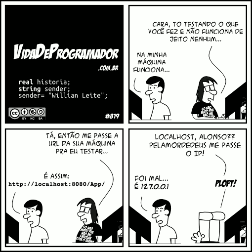

Setup ambiente de desenvolvimento
=================================

Pré requisitos:
---------------

- Para se desenvolver Odoo, é recomendável ambiente GNU/Linux;
- É recomendado utilizar a mesma distribuição e versão da produção: **Ubuntu 14.04 LTS**
- Conta no github: https://github.com

Dependencias:
-------------
.. to big

- GNU/Linux;
- PostgreSQL;
- Bibliotecas C;
- Python e Bibliotecas que estendem a stadard library;
- Outras dependências ( reports e outros );

.. nextslide::

.. code-block:: shell

    sudo locale-gen pt_BR
    sudo locale-gen pt_BR.UTF-8
    sudo dpkg-reconfigure locales
    sudo update-locale LANG=pt_BR.UTF-8

    sudo apt-get install -y tig binutils build-essential bzr ca-certificates cpp
        gcc dpkg-dev fontconfig fontconfig-config gir1.2-glib-2.0 git git-core
        git-man libapparmor1 libc-dev-bin libc6-dev libcloog-isl4 libcurl3-gnutls
        libdatrie1 libdbus-glib-1-2 libdpkg-perl libelf1 liberror-perl
        libexpat1-dev libfontconfig1 libfontenc1 libfreetype6 libfreetype6-dev
        libhcrypto4-heimdal libheimbase1-heimdal libheimntlm0-heimdal libhx509-5-heimdal
        libice6 libidn11 libisl10 libjpeg-dev libjpeg-turbo8 libjpeg-turbo8-dev
        libjpeg62 libjpeg8 libjpeg8-dev libjs-jquery libk5crypto3 libkeyutils1
        libkrb5-26-heimdal libkrb5-3 libkrb5support0 libldap-2.4-2 libldap2-dev
        libllvm3.4 libltdl7 libmpfr4 liborc-0.4-0 libpciaccess0 libpixman-1-0
        libpng12-dev libpq-dev libpq5 libroken18-heimdal librtmp0 libsasl2-2
        libsasl2-dev libsasl2-modules libsm6 libssl-dev libssl-doc libsvn1
        libwind0-heimdal libxml2 libxml2-dev libyaml-0-2 libyaml-dev linux-libc-dev
        make mercurial mercurial-common python-bzrlib python-configobj python-crypto
        python-dev python-gi python-httplib2 python-keyring python-pkg-resources
        python-simplejson python-wadllib python2.7-dev rsync shared-mime-info
        subversion python-dateutil python-feedparser python-ldap python-libxslt1
        python-lxml python-mako python-openid python-psycopg2 python-pybabel
        python-pychart python-pydot python-pyparsing python-reportlab python-tz
        python-vatnumber python-vobject python-webdav python-werkzeug python-xlwt
        python-yaml python-zsi python-docutils python-psutil python-mock
        python-unittest2 python-jinja2 python-pypdf python-decorator
        python-requests python-passlib python-software-properties
        libxslt1-dev python-pip python-libxml2 libxmlsec1-dev openjpeg-tools
        libopenjpeg2 libopenjpeg-dev libtiff4-dev zlibc zlib-bin zlib1g-dev
        liblcms2-dev libwebp-dev tcl8.5-dev tk8.5-dev python-tk screen
        libxrender1 libxt6 tar zip gzip  zlib1g xfonts-75dpi xfonts-base
        python-genshi python-cairo python-cairo-dev libcups2-dev python-cups
        node-less libgeos-c1 libffi-dev || exit

Wkhtmltopdf
-----------

É uma dependência de tempo de execução do Odoo usado para gerar relatórios em PDF.

.. code-block:: shell

    cd /tmp
    wget http://download.gna.org/wkhtmltopdf/0.12/0.12.1/wkhtmltox-0.12.1_linux-trusty-amd64.deb
    sudo dpkg -i wkhtmltox-*.deb
    sudo cp /usr/local/bin/wkhtmltopdf /usr/bin
    sudo cp /usr/local/bin/wkhtmltoimage /usr/bin

Ambientes virtuais Python
-------------------------

- Python virtual environments, ou **virtualenv** são ambientes de trabalhos python isolados.
- Permitem aos desenvolvedores trabalharem com diferentes versões de bibliotecas python instaladas.
- É possivel criar quantos ambientes forem precisos;

`Documentação oficial <https://virtualenv.pypa.io/en/stable/>`_

Configuração do ambiente de desenvolvimento
-------------------------------------------

Buildout: Contruindo ambientes replicáveis (continua)
-----------------------------------------------------
  Na minha maquina funciona

  -- Alonso, desenvolvedor

Buildout é um sistema de *build* baseado em Python para a criação, montagem e
implantação de aplicativos de com vários componentes, alguns dos quais não são
necessáriamente baseados em Python. Ele permite você criar uma "receita" e
replicar o mesmo software posteriormente.

