Introdução a Criação de Módulos
===============================

Introdução
----------

**Objetivo:** Entender como um módulo Odoo é estruturado, seus componentes e
como realizar o desenvolvimento incremental do mesmo.

Criando e instalando um novo módulo
-----------------------------------

A partir do diretório do treinamento:

.. code-block:: shell

    cd parts/odoo/addons/
    mkdir meu_modulo
    cd meu_modulo
    touch __init__.py
    nano __manifest__.py

- Adicione no aquivo __manifest__.py um dicionário

.. code-block:: python

    {'name': 'Meu modulo'}

.. nextslide::

1. Inicie o Odoo. 

Pelo Shell:

.. code-block:: shell

    bin/start_odoo

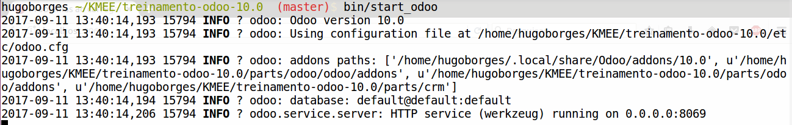

No navegador:

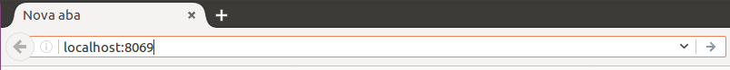

.. nextslide::

2. Ative o modo desenvolvedor pelo menu Aplicativos. Em 'Habilitar Modo Desenvolvedor'.

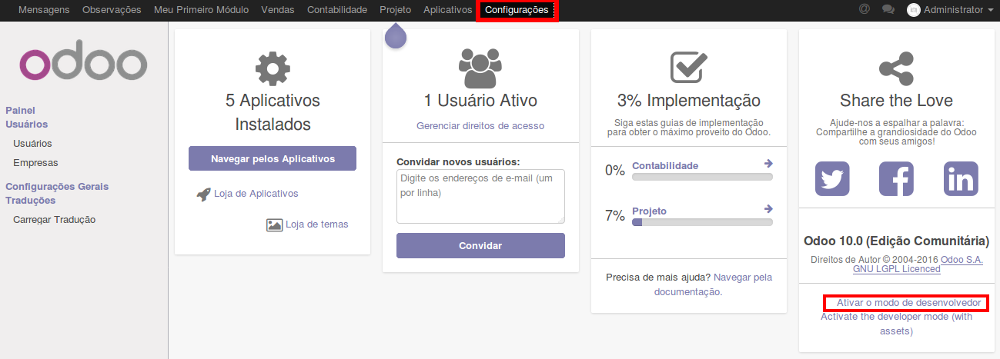

.. nextslide::

3. Acesse o menu Aplicativos > Atualizar lista de Aplicativos ( Devemos fazer isso sempre que um novo módulo é disponibilizado em um banco de dados )

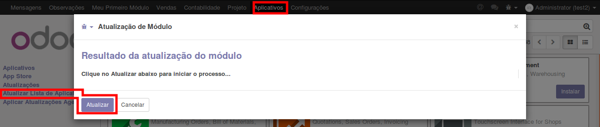

.. nextslide::

4. Procure seu módulo na lista de aplicativos e o instale.

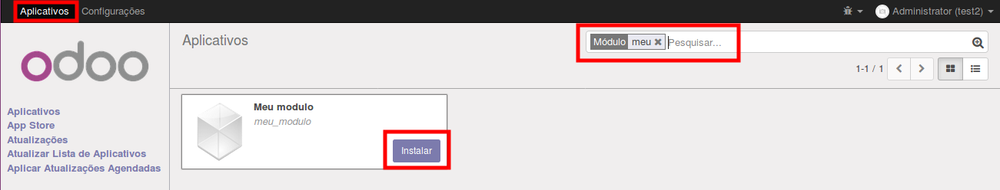

.. nextslide::
- Um módulo Odoo é um diretório contendo arquivos;
- O nome da pasta é o nome técnico;
- O 'name' definido no dicionário do manifesto é o Título do módulo.
- O arquivo __manifest__.py é o manifesto do módulo. Ele contém um dicionário com os detalhes do módulo: descrição, depêndencias, data que deve ser carregado, etc;
- O diretório deve ser importável pelo python, ou seja, ter um arquivo __init__.py mesmo que vazio. Ele também pode conter os módulos python e submódulos que devem ser importados.

Arquivo de Manifesto
--------------------
Preencha seu arquivo __manifest__.py com as chaves mais significativas conforme o exemplo:

.. code-block:: python

    # -*- coding: utf-8 -*-
    {
        'name': "Meu Módulo",
        'summary': "Esta é uma descrição simples do novo módulo que estou desenvolvendo",
        'description': """Este campo deve ser usado para fornecer uma descrição mais completa 
                          sobre o módulo o qual estou desenvolvendo""",
        'author': "MeuNomeCompleto",
        'license': "AGPL-3",
        'website': "http://www.meuwebsite.com.br",
        'category': 'Uncategorized',
        'version': '10.0.1.0.0',
        'depends': ['base'],
        #'data': ['views/meu_modulo.xml'],
        #'demo': ['demo.xml'],
    }

.. nextslide::

- O trecho -*- coding: utf-8 -*- permite que utilizemos caracteres não ASCII no arquivo.
- **name:** O título do módulo
- **summary:** Um subtítulo com uma linha
- **description:** Deve ser escrito no padrão `ReStructuredText <http://docutils.sourceforge.net/docs/user/rst/quickstart.html>`_
- **author:** O nome dos autores separados por vírgula.
- **license:** AGPL-3 , LGPL-3 , Other OSI approved license etc.
- **website:** Url para dar mais informações sobre os autores

.. nextslide::

- **category:** `Lista de categorias possiveis <https://github.com/odoo/odoo/blob/master/openerp/addons/base/module/module_data.xml>`_
- **versao:** Versão do módulo
- **depends:** É uma lista de com os nomes técnicos que este módulo depende.

**Importante:** Se não depender de nenhum módulo, ao menos deve depender do módulo **base**. Qualquer referência que seu módulo realize com xmls ids, visões ou modelos refenciados por este módulo.

Esta lista garante que tudo será carregado na ordem correta.

- **data:** Lista dos caminhos dos arquivos de dados
- **demo:** Lista dos caminhos dos arquivos de demo

Estrutura de arquivos do módulo
-------------------------------

Crie os arquivos:

.. code-block:: shell

    cd path/to/my-module
    mkdir models
    touch models/__init__.py
    mkdir controllers
    touch controllers/__init__.py
    mkdir views
    mkdir security
    mkdir data
    mkdir demo
    mkdir i18n
    mkdir -p static/description

Defina um ícone para o seu módulo, copiando uma imagem PNG para a pasta
static/description/icon.png

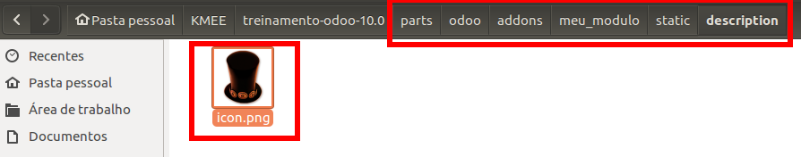

.. nextslide::

Edite o arquivo __init__.py da raíz do módulo com os dados:

.. code-block:: python

    # -*- coding: utf-8 -*-
    from . import models
    from . import controllers

Essa importação só é possívels pois os diretórios ``models`` e ``controllers`` possuem arquivos __init__.py em seus interiores.

.. nextslide::

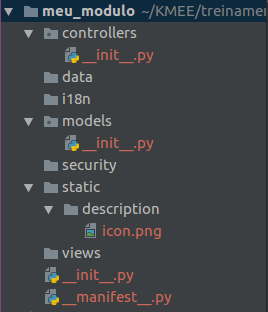

.. nextslide::

Um módulo Odoo pode conter três tipos de aquivos:

- Arquivos python
- Arquivos de dados: XML / CSV / YML
- Arquivos Web: Css / Qweb / HTML

Adicionando modelos
-------------------

Crie um arquivo na pasta models, chamado de meu_modulo.py com o conteúdo:

.. code-block:: python

    # -*- coding: utf-8 -*-

    from odoo import models, fields

    class MeuModulo(models.Model):

        _name = 'meu.modulo'

        name = fields.Char(string=u'Nome', required=True)
        date = fields.Date(string=u'Data')
        partner_ids = fields.Many2many(
            comodel_name='res.partner',
            string=u'Parceiro',
        )

Modifique arquivo __init__.py da pasta models importando o seu módulo:

.. code-block:: python

    from . import meu_modulo

.. nextslide::

- Modelos Odoo são objetos derivados da classe Odoo Model.
- Quando um novo módulo é definido ele é adicionado à tabela de modelos (ir_model)
- Modelos têm alguns atributos definidos com underline. O mais importante é o **_name**, que define um identificador único do modelo na instância
- As mudanças nos modelos são carregadas quando atualizamos os módulos

.. nextslide::

Atualize seu módulo e verifique se o banco de dados e as tabelas de dados foram alteradas.

.. code-block:: shell

    bin/start_odoo -d dbname -u meu_modulo --stop-after-init

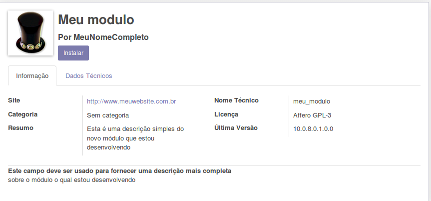

Adicionando Menus e visões
--------------------------

Crie um arquivo de visão na pasta views/meu_modulo.xml com o conteudo:

.. code-block:: xml

    <?xml version="1.0" encoding="utf-8"?>
    <odoo>
        <act_window
            id="meu_modulo_action"
            name="Minha Acao"
            res_model="meu.modulo" />

        <menuitem
            id="meu_modulo_menu"
            name="Meu Menu"
            action="meu_modulo_action"
            parent=""
            sequence="5" />
    </odoo>

Adicione-o na sessão data no arquivo __manifest__.py:

.. code-block:: xml

    'data': ['views/meu_modulo.xml'],

.. nextslide::

Atualize seu módulo e verifique as alterações

.. code-block:: shell

    bin/start_odoo -d dbname -u meu_modulo --stop-after-init

O ``<menuitem ... />`` cria um item de menu na barra superior do Odoo, onde são exibidos os módulos instalados. 

Ao clicar no seu módulo, será chamado o item de índice ``meu_modulo_action``, que é uma janela ativa, contendo por padrão um formulário e alguns botões já funcionais.

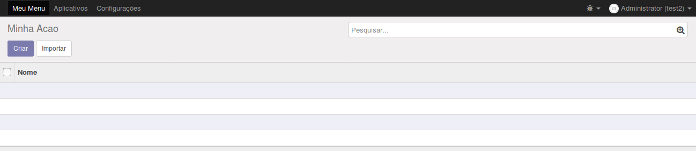

.. nextslide::

Defina um formulário personalizado(meu_modulo.xml):

.. code-block:: xml
    
    <odoo>
    ...
        <record id="meu_modulo_view_form" model="ir.ui.view">
            <field name="name">Meu modulo Form</field>
            <field name="model">meu.modulo</field>
            <field name="arch" type="xml">
                <form>
                    <group>
                        <field name="name"/>
                        <field name="partner_ids" widget="many2many_tags"/>
                    </group>
                    <group>
                        <field name="date"/>
                    </group>
                </form>
            </field>
         </record>
    ...
    </odoo>

.. nextslide::

Defina uma visão lista:

.. code-block:: xml

    <odoo>
    ...
        <record id="meu_modulo_view_tree" model="ir.ui.view">
            <field name="name">Meu modulo List</field>
            <field name="model">meu.modulo</field>
            <field name="arch" type="xml">
                <tree>
                    <field name="name"/>
                    <field name="date"/>
                </tree>
            </field>
        </record>
    ...
    </odoo>

.. nextslide::

Defina uma busca personalizada:

.. code-block:: xml

    <odoo>
    ...
        <record id="meu_modulo_view_search" model="ir.ui.view">
            <field name="name">Meu modulo Search</field>
            <field name="model">meu.modulo</field>
            <field name="arch" type="xml">
                <search>
                    <field name="name"/>
                    <field name="partner_ids"/>
                    <filter string="S/ Parceiros"
                        domain="[('partner_ids','=',False)]"/>
                </search>
            </field>
        </record>
    ...
    </odoo>

.. nextslide::

Atualize seu módulo e verifique se o banco de dados e as tabelas de dados foram alteradas.

.. code-block:: shell

    bin/start_odoo -d dbname -u meu_modulo --stop-after-init

* ``meu_modulo_view_form`` é o formulário para cadastro de um novo campo. Cada um dos atributos "name" informam um campo do formulário.
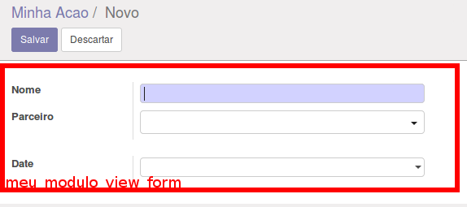

.. nextslide::

* ``meu_modulo_view_tree`` é a exibição de todos os campos do formulário. Cada um dos atributos "name" definem uma das colunas de filtragem no formulário. 
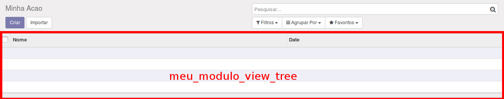

* ``meu_modulo_view_search`` configura a barra de pesquisa do formulário. 

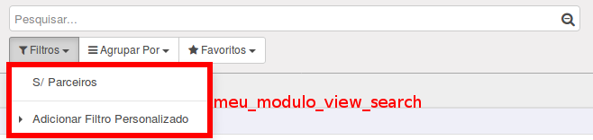

