Modelos de dados
================

Módulo de controle de biblioteca
--------------------------------

A partir dessa seção, trabalharemos na construção de um novo módulo para controle de uma biblioteca.

Definindo um modelo de dados
----------------------------

Seguindo os passos já apresentados, crie um módulo chamado ``Library Book`` numa pasta chamada ``library_book``.

**Obs:** Lembre-se de mudar os nomes de ``meu_modulo`` para ``library_book`` em todos os arquivos.

.. nextslide::

Após criado o módulo, é esperada a seguinte estrutura:

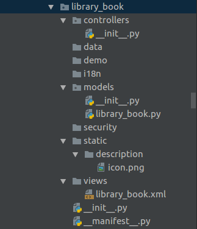

.. nextslide::

... e o aplicativo intalado deve estar semelhante ao seguinte:

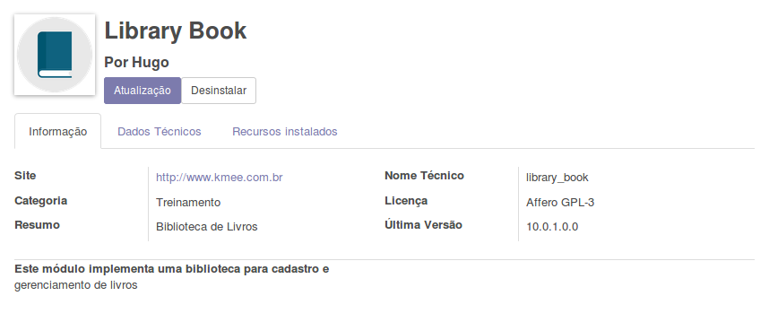

.. nextslide::

Modelos de dados têm atributos definindo o seu comportamento.

Estes atributos são pré-fixados com underline, sendo o mais importante o atributo **_name**, que define o identificador global do modelo.

Definindo uma descrição amigável
--------------------------------

.. code-block:: python

    _description = 'Library Book'

- OBS: A descrição é um campo importante para o módulo de email, pois define algumas notificações quando novos registros são criados.

.. nextslide::

Alterando a ordem de exibição:
------------------------------

.. code-block:: python

    _order = 'date_release desc, name'

- Por padrão o id é utilizado.
- Somente campos "stored" pode ser utilizados.

Representando o modelo de outra forma: _rec_name
------------------------------------------------

.. code-block:: python

    _rec_name = 'short_name'
    short_name = fields.Char('Short Title')

- Quando referenciamos um modelo relacional, este campo é utilizado para representar o modelo, ao invés do id.
- Por padrão o campo **_rec_name** sempre exibe o campo **name**, por isso é importante defini-lo.
- Se o campo name não for definido e nem _rec_name então o nome do modelo será uma tupla: (_name, id)

Display name / name_get()
-------------------------

- A representação de um modelo é definida por um campo **display_name**
- Seu valor é gerado pela função name_get() onde a implementação padrão utiliza o campo **_rec_name**

Sobrescrevendo esta lógica:

.. literalinclude:: code/name_get
   :language: python
   :linenos:

Campos
======

Não relacionais
---------------

Campos são adicionados aos modelos quando definimos um atributo nas classes Python. Por exemplo:

.. code-block:: python

    from odoo import models, fields

    class AModel(models.Model):

        _name = 'a_name'

        name = fields.Char(
            string="Name",                   # Optional label of the field
            compute="_compute_name_custom",  # Transform the fields in computed fields
            store=True,                      # If computed it will store the result
            select=True,                     # Force index on field
            readonly=True,                   # Field will be readonly in views
            inverse="_write_name"            # On update trigger
            required=True,                   # Mandatory field
            translate=True,                  # Translation enable
            help='blabla',                   # Help tooltip text
            company_dependent=True,          # Transform columns to ir.property
            search='_search_function'        # Custom search function mainly used with compute
        )
       # The string key is not mandatory
       # by default it wil use the property name Capitalized
       name = fields.Char()  #  Valid definition

Atributos
---------

1. Atributos padrão para todos os fields

.. literalinclude:: code/fields-attributes
   :language: python
   :linenos:

2. Somente para char

.. literalinclude:: code/fields-char
   :language: python
   :linenos:

.. nextslide::

3. Somente para HTML

.. literalinclude:: code/fields-html
   :language: python
   :linenos:

.. nextslide::

- **string** é o título do campo, usado em 'UI view labels'. Se não for setado, uma label será gerada a partir do campo **name**, substituindo underscores por espaço e capitalizando as primeiras letras das palavras.
- **size** apenas se aplica a campos Char e indica o máximo número de caracteres permitidos. Em geral, seu uso não é recomendado.
- **translate** quando é setado como True, deixa com campo traduzível; Pode ter diferentes valores dependendo do idioma da interface do usuário.
- **default** é o valor padrão. Também pode ser uma função usada para calcular o valor padrão. Por exemplo, default=_compute_default, onde compute_default é um método definido no modelo previamento ao campo.

.. nextslide::

- **help** é um texto de explicação exibida na 'UI tooltips'.
- **groups** faz com que o campo fique disponível apenas para aguns security groups. É composto por uma string contendo uma lista de XML IDs para security groups separadas por vírgula. 
- **states** permite a interface de usuário setar dinamicamente valores para readonly, required e invisible, dependendo do valor contido no campo **state**. Além isso, é necessária a existência e utilização de um campo **state** no Form View (mesmo que seja um campo invisible).

.. nextslide::

- **copy** serve como uma flag, indicando se o valor do campo foi copiado enquanto o record está duplicado. Por padrão, é TRUE para campos não-relacionais ou Many2one ou FALSE para One2many e campos computados. 
- **index**, quando setado para True, habilita a criação de um index no banco para o campo, possibilitando buscas mais rápidas. Veio para substituir o atributo obsoleto select=1.
- **readonly** é uma flag que habilita o campo apenas para a leitura como configuração padrão na interface de usuário.
- **required** é uma flag que torna o campo obrigatório por padrão na interface de usuário.

.. nextslide::

- **sanitize** é uma flag usada por campos HTML que retira tags inseguras de seu conteúdo.
- **strip_style** também é um atributo de campo HTML que utiliza o **sanitize** para remover também elementos de estilo inseguros.
- **company_depentent** é uma flag que permite ao campo guardar diferentes valores por empresas. Veio para substituir o obsoleto campo Property.

Campos não relacionais
----------------------

Os campos não relacionais podem ser:

- **Char** para valores;
- **Text** para textos de múltiplas linhas;
- **Selection** para lista de seleção, definido por uma lista de tuplas. Sendo que o valor a ser salvo no banco de dados pode ser somente do tipo inteiro e char.
- **Html** similar ao campo de texto, mas espera uma HMTL.
- **Binary** salva dados binários (arquivos, imagens e documentos).

.. nextslide::

- **Boolean** true / false ( No postgres 't' ou 'f' );
- **Date** O ORM lida com elas no formato string. Mas elas são salvas no DB no formato DATE.
- **Datetime** O ORM lida com elas no formato string. Mas elas são salvas no DB no formato DATE UTC.
- **Integer**
- **Float** Valores numéricos, opicionalmente definidos com o número de dígitos e sua parte decimal.
- **Monetary** Podem salvar um valor em determinada moeda. **Somente na v9+**

.. nextslide::

Defina alguns campos novos:

.. literalinclude:: code/fields
   :language: python
   :linenos:

.. nextslide::

.. literalinclude:: code/fields2
   :language: python
   :linenos:

.. nextslide::

Os campos criados no passo anterior podem ser vistos em: ``Configurações >> Estrutura de Dados >> Modelos``

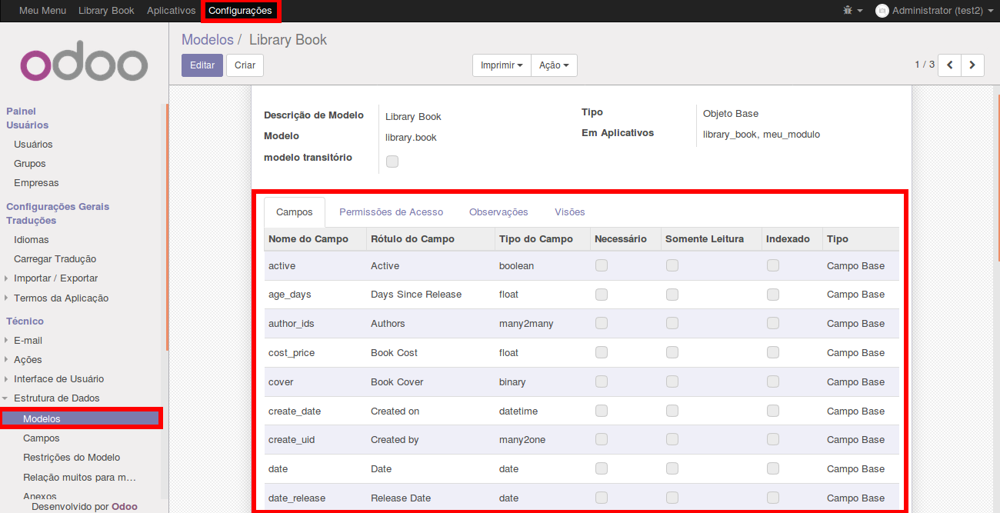

.. nextslide:: 

Edite o arquivo ``library_book.xml``:

.. literalinclude:: code/library_book_xml1
   :language: python
   :linenos:

.. nextslide::

O código anterior insere no formulário "library_book_view_form" os campos inseridos na classe.
O resultado deve ser algo assim:

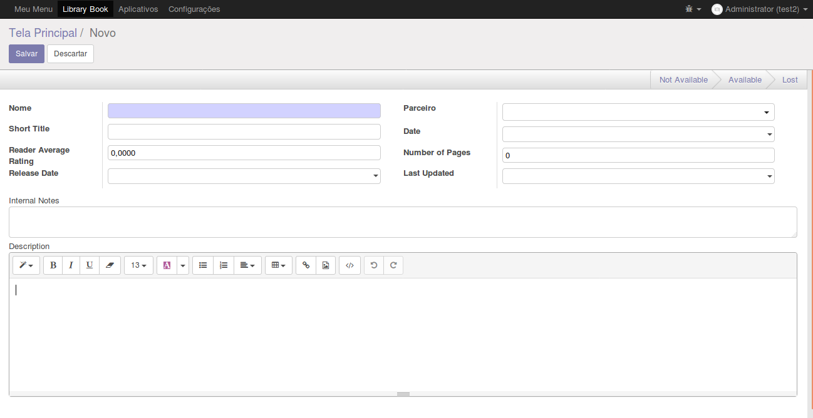

.. nextslide::

Edite novamente o arquivo ``library_book.xml``:

.. literalinclude:: code/library_book_xml2
   :language: python
   :linenos:

.. nextslide::

O código anterior insere no formulário "library_book_view_tree" os campos inseridos na classe.

O resultado deve ser algo assim:

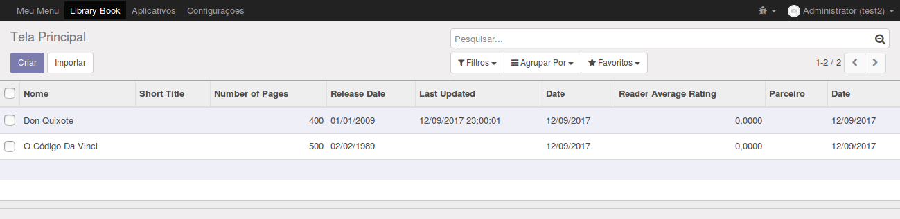

.. nextslide::

Edite novamente o arquivo ``library_book.xml``:

.. literalinclude:: code/library_book_xml3
   :language: python
   :linenos:

.. nextslide::

O código anterior adiciona filtros de pesquisa dentro do formulário do módulo.

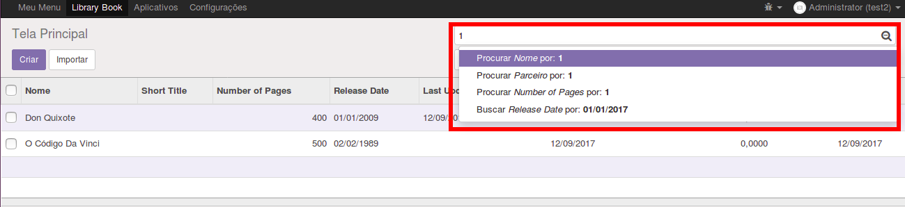

Métodos especiais de data
-------------------------

**Date**

.. code-block:: python

    from datetime import date

Store date.
Alguns métodos definidos no date que podemos utilizar:

* ``context_today`` retorna o dia atual em uma String, por timezone
* ``today`` retorna a data atual do sistema em uma String
* ``from_string`` retorna um datetime.date() a partir de uma String 
* ``to_string`` retorna a data em uma String a partir de um datetime.date

.. nextslide::

.. code::

    >>> from odoo import fields

    >>> adate = fields.Date()
    >>> fields.Date.today()
    '2014-06-15'
    >>> fields.Date.context_today(self)
    '2014-06-15'
    >>> fields.Date.context_today(self, timestamp=datetime.datetime.now())
    '2014-06-15'
    >>> fields.Date.from_string(fields.Date.today())
    datetime.datetime(2014, 6, 15, 19, 32, 17)
    >>> fields.Date.to_string(datetime.datetime.today())
    '2014-06-15'

.. nextslide::

**DateTime**

.. code-block:: python
  
    from datetime import datetime

Store datetime.

Alguns métodos definidos no datetime que podemos utilizar:

* ``context_timestamp`` retorna o dia atual em uma String, por timezone
* ``now`` retorna a atual data do sistema em uma String
* ``from_string`` retorna datetime.date() a partir de uma String
* ``to_string`` retorna a data em uma String a partir de um datetime.date

.. nextslide::

::

    >>> fields.Datetime.context_timestamp(self, timestamp=datetime.datetime.now())
    datetime.datetime(2014, 6, 15, 21, 26, 1, 248354, tzinfo=<DstTzInfo 'Europe/Brussels' CEST+2:00:00 DST>)
    >>> fields.Datetime.now()
    '2014-06-15 19:26:13'
    >>> fields.Datetime.from_string(fields.Datetime.now())
    datetime.datetime(2014, 6, 15, 19, 32, 17)
    >>> fields.Datetime.to_string(datetime.datetime.now())
    '2014-06-15 19:26:13'

Campos padrão
-------------

Todo modelo tem alguns campos padrão que são gerados automaticamente:

- **create_date** is the record creation timestamp
- **create_uid** is the user that created the record
- **write_date** is the last recorded edit timestamp
- **write_uid** is the user that last edited the record

- Eles podem ser desativados com o atributo ``_log_access=False``
- Para exibi-los na visão é preciso sobrescrevê-los no modelo.

Active
------

Um outro campo especial é o campo 'active'. Ele deve ser um campo booleano para determinar se o registro será ou não ativo.

.. code-block:: python

    active = fields.Boolean('Active', default=True)

Por definição todas as visões tem os dominio [('active', '=', False)]

Como alternativa podemos adicionar no contexto 'active_test': False para que o
ORM não filtre somente pelos campos ativos.

Float com precisão decimal configurável
--------------------------------------
1. Adicione uma nova dependência ao nosso módulo:

.. code-block:: python

    'depends': ['base', 'decimal_precision'],

2. Adicione o trecho:

.. code-block:: python

    from odoo.addons import decimal_precision as dp
    # ...
    class LibraryBook(models.Model):
    # ...
        cost_price = fields.Float(
            'Book Cost', dp.get_precision('Book Price'))

.. nextslide::

3. Decimal precision

.. code-block:: xml

    <?xml version='1.0' encoding='UTF-8'?>
    <odoo>
    ...
        <data noupdate="1">
            <record id="book_price_precision" model="decimal.precision">
                <field name="name">Book Price</field>
                <field name="digits">2</field>
            </record>
        </data>
   ...
    </odoo>

Campos relacionais
==================

Campos relacionais
------------------

Podemos definir três tipos de campos relacionais no Odoo:

1. many-to-one
2. one-to-many
3. many-to-many

.. nextslide::

1. Analisando do ponto de vista da **Biblioteca de Livros** temos:

- Cada livro pode ter um editor;
- Então teremos uma relação many-to-one entre livros e editores.

.. code-block:: python

    class LibraryBook(models.Model):
        # ...
        publisher_id = fields.Many2one(
            comodel_name='res.partner', 
            string='Publisher',
            # optional:
            ondelete='set null',
            context={},
            domain=[],
        )

.. nextslide::

2. Analisando do ponto de vista do **Editor** temos:

- Cada editor pode ter múltiplos livros;
- Então a relação anterior de many-to-one implica uma relação reversa one-to-many.

.. code-block:: python

    class ResPartner(models.Model):
        _inherit='res.partner'
        book_ids_pub = fields.One2many(
            comodel_name='library.book', 
            inverse_name='publisher_id',
            string='Published Books',
        )

.. nextslide::

3. Analisando do ponto de vista dos **Livros** temos:

- Cada livro pode ter múltiplos autores;
- Cada autor pode ter mútiplos livros; Então temos uma relação many-to-many.

.. code-block:: python

    class LibraryBook(models.Model):
        # ...
        author_ids = fields.Many2many(
            comodel_name='res.partner', 
            string='Authors',
        )

    class ResPartner(models.Model):
        # ...
        book_ids_aut = fields.Many2many(
            comodel_name='library.book',
            string='Authored Books',
            # relation='library_book_res_partner_rel' Opcional
        )

.. nextslide::

Atributos:

- ondelete: setnull ( default ) / restrict / cascade.
- context: adiciona variáveis no contexto do cliente ao clicar no campo através dos registros relacionados. Podemos por exemplo definir um valor padrão para o modelo relacionado.
- domain: Permite limitar os registros relacionados.

.. nextslide::

Observações:

- One2many: São relações reversas de Many2One, apesar deles serem adionados nos modelos como qualquer outro campo eles não têm representação no banco de dados.
- Many2many: Não são adicionadas colunas nas duas tabelas. É utilizado uma tabela intermediária. O Odoo gera estas tabelas automaticamente.
- auto_join: Podem ser usados nos campos Many2one, permitem o ORM utilizar joins, podendo resolver problemas de performance. Apesar de pular regras de controle de acesso.

.. nextslide::

Agora que foram criadas as relações entre LibraryBook, Authors e Publishers, restam criar seus campos na visão, em ``library_book.xml``:

.. code-block:: python

     <record id="library_book_view_form" model="ir.ui.view">
	...
                    <group>
			...
                        <field name="publisher_id"/>
			...
                    </group>
                    <group>
			...
                        <field name="author_ids" widget="many2many_tags"/>
			...
                    </group>
	...
     </record>

Resultado:

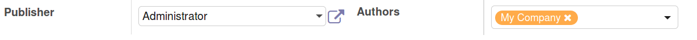

Hierarquia
----------

São representações de modelos relacionados com eles mesmos.
Crie o arquivo models/library_book_categ.py , para as categorias, lembre-se de importá-lo no arquivo __init__.py

.. code-block:: python

    # -*- coding: utf-8 -*-
    from odoo import models, fields, api

    class BookCategory(models.Model):

        _name = 'library.book.category'

        name = fields.Char('Category')
        parent_id = fields.Many2one(
            comodel_name='library.book.category',
            string='Parent Category',
            ondelete='restrict',
            index=True,
        )
        child_ids = fields.One2many(
            comodel_name='library.book.category', 
            inverse_name='parent_id',
            string='Child Categories',
        )

.. nextslide::

.. code-block:: python

    class BookCategory(models.Model):
        #...

        #Adicione o suporte a hierarquia:
        _parent_store = True
        parent_left = fields.Integer(index=True)
        parent_right = fields.Integer(index=True)

        # Para prevenir relações em loop:
        @api.constrains('parent_id')
        def _check_hierarchy(self):
            if self._check_recursion():
                raise models.ValidationError(
                    'Error! You cannot create recursive categories.')

        def _check_recursion(self):
            return self.parent_id == self.id

Arquivo ``models/__init__.py``

.. code-block:: python

    from . import library_book
    from . import library_book_categ

Constraints
----------

Na classe ``LibraryBook``, adicione os seguintes trechos:

1. Limitando o campo ``date_release`` por Python

.. code-block:: python

    @api.constrains('date_release')
    def _check_release_date(self):
        for r in self:
            if r.date_release > fields.Date.today():
            raise models.ValidationError(
                'Release date must be in the past')

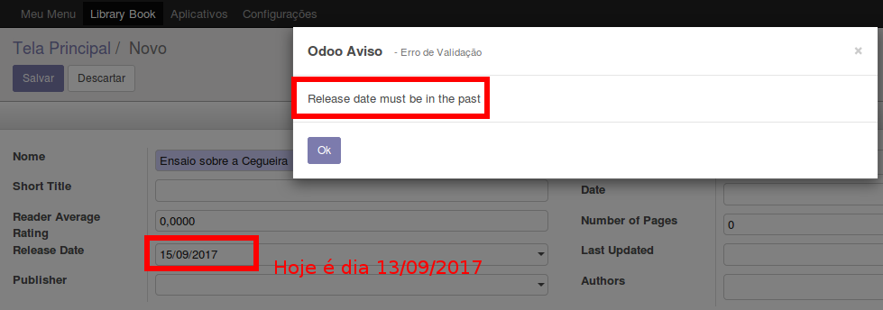

.. nextslide::

2. Limitando Campos por SQL: lista com tuplas definindo as contraints, no formato (name, sql_def, message).

.. code-block:: python

    _sql_constraints = [
        ('name_uniq',
        'UNIQUE (name)',
        'Book title must be unique.')
        ]

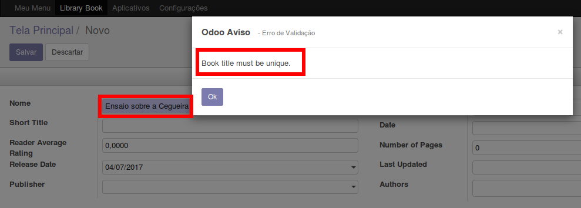

Campos calculados
-----------------

Usamos este recurso quando precisamos que um campo seja calculado a partir de
outros valores no mesmo modelo ou até mesmo nos modelos relacionados.

Um exemplo típico é quando o total é calculado a partir da multiplicação do preço com a quantidade.

.. nextslide::

Adicione o seguinte código:

.. code-block:: python

    class LibraryBook(models.Model):

        age_days = fields.Float(
            string='Days Since Release',
            compute='_compute_age',
            inverse='_inverse_age',
            search='_search_age',
            store=False,
            compute_sudo=False,
            )

* ``compute=`` Faz com que o campo seja preenchido automaticamente pelo método especificado

* ``inverse=`` ...

* ``search=`` Implementa a busca no campo

* ``store=`` Diz se o campo será armazenado no banco. (``False`` por padrão em campos computados)

.. nextslide::

.. code-block:: python

    from datetime import timedelta
  
    class LibraryBook(models.Models):
	#...

        #Lógica que implementa escrita no campo
        @api.depends('date_release')
        def _compute_age(self):
            today = fields.Date.from_string(fields.Date.today())
            for book in self.filtered('date_release'):
                delta = (fields.Date.from_string(book.date_release - today))
                book.age_days = delta.days
    
        def _inverse_age(self):
            today = fields.Date.from_string(fields.Date.today())
            for book in self.filtered('date_release'):
                d = timedelta(days=book.age_days) - today
                book.date_release = fields.Date.to_string(d)

        #Lógica que implementa a pesquisa no campo
        def _search_age(self, operator, value):
            today = fields.Date.from_string(fields.Date.today())
            value_days = timedelta(days=value)
            value_date = fields.Date.to_string(today - value_days)
            return [('date_release', operator, value_date)]

.. nextslide::

- A definição de um campo calculado é como qualquer outro exceto pelo parâmetro ``compute`` que é usado para realizar o cálculo do mesmo.

- Campos calculados são computados em tempo de execução e, a não ser que você explicitamente dê suporte à escrita (inverse), ou à pesquisa (search), isto não será possível.

- Podemos tornar campos calculados pesquisáveis ao implementarmos o metodo ``search``.
Opcionalmente podemos utilizar o parametro **store=True** para tornar o campo
pesquisável. Graças ao decorator @api.depends o ORM saberá quando este campo deve
ser recalculado.

.. nextslide::

- computed_sudo=True pode ser utilizado quando o cálculo deve ser feito com privilégios administrativos. Quando é preciso utilizar dados que podem não ser acessíveis aos usuários comuns.

.. nextslide::

Coloque o campo ``age_days`` na visão, em ``library_book_view_tree`` e avalie os resultados:

.. code-block:: xml

        <field name="age_days" />

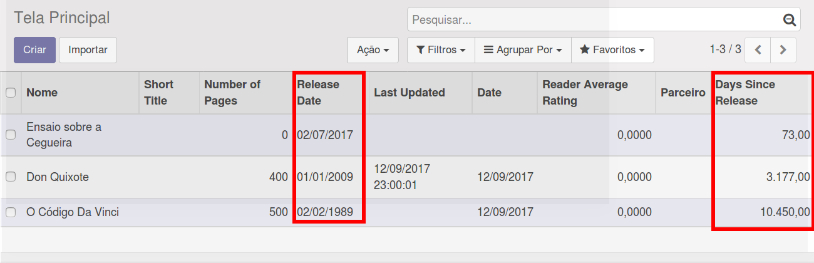

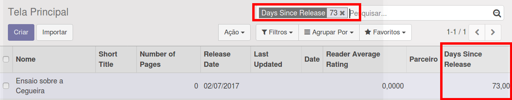

Exibindo campos relacionais salvos em outros modelos
----------------------------------------------------

Quando o cliente Odoo acessa as informações ele só tem acesso aos dados dos
campos disponíveis nos modelos da consulta. O lado do cliente não pode usar notação
ponto para acessar dados relacionais.

Estes dados podem ser disponibilizados através de campos **related**

.. code-block:: python

    LibraryBook(models.Models):
        #...
        publisher_city = fields.Char(
            string='Publisher City',
            related='publisher_id.city',
            store=True,
        )

- São campos calculados e podem ter o parâmetro store=True para serem pesquisáveis.

.. nextslide::

Na visão, em ``library_book_view_form`` adicione o campo publisher_city como apenas leitura:

.. code-block:: xml

    <field name="publisher_city" readonly="True"/>

E em ``library_book_view_tree``:

.. code-block:: xml

    <field name="publisher_city"/>

Quando for cadastrar um livro com um Publisher definido, o campo publisher_city buscará a cidade cadastrada para esse Publisher e criará uma cópia para seu livro.

.. nextslide::

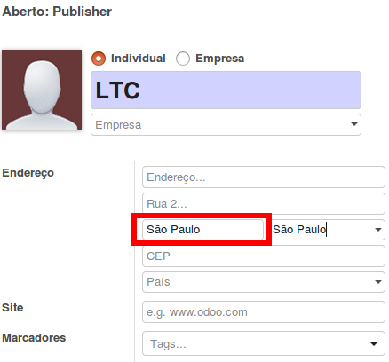

.. nextslide:: 

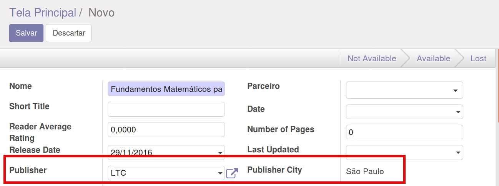

Adicionando campos dinâmicos através de referências
---------------------------------------------------

Permitem ao usuário definir o relacionamento com um modelo escolhido e então o selecioná-lo.

.. code-block:: python

    @api.model
    def _referencable_models(self):
        models = self.env['res.request.link'].search([])
        return [(x.object, x.name) for x in models]

    ref_doc_id = fields.Reference(
        selection='_referencable_models',
        string='Reference Document',
    )

- Devemos sempre usar a api.model.
- Podemos consultar a tabela de res.resquest.link ou definir uma lista de campos conforme a notação:

.. code-block:: python

    [('res.users', 'User'), ('res.partner', 'Partner')]

Relação entre modelos
=====================

Adicionando funcionalidades através de herança
--------------------------------------------
Uma das funcionalidades mais importantes do Odoo é a habilidade de estender recursos de um módulo
em outro módulo sem a necessidade de editar o código dos recursos original.

Esse recurso pode ser utilizado para adicionar campos em métodos, modificar campos existentes ou estender
métodos existentes para adicionar uma lógica adicional.

.. nextslide::

1. Primeiro, precisamos verificar que o campo authored_book_ids está disponível
no cadastro de parceiros:

.. literalinclude:: code/34.py
   :language: python
   :linenos:

.. nextslide::

2 .Segundo, adicione o método que utilizamos para calcular o count:

.. literalinclude:: code/35.py
   :language: python
   :linenos:

Modelos abstratos
-----------------

Modelos abstratos permitem criar um modelo genérico que implementa alguma
característica que pode ser herdada por outros modelos.

1. Crie um modelo abstrato para o recurso de arquivamento. Ele deve ser definido
**dentro da classe  LibraryBook.**

.. literalinclude:: code/32.py
   :language: python
   :linenos:

.. nextslide::

2. Edite o modelo LibraryBook para estender o modelo Archive

.. literalinclude:: code/33.py
   :language: python
   :linenos:

Delegação para copiar funcionalidades
-------------------------------------
Usando a hernaça tradicional _inherit executa a modificação no local para estender as	
características do modelo.

Mas há casos em que em vez de modificar um modelo existente, é necessário criar um novo
modelo baseado em um já existente para alavancar os recursos existentes.

Isso pode ser realizado com o atributo de modelo, __inherits (note o "s" adicional).

.. nextslide::

1. Adicionando um novo modelo, sobrescrevendo a partir do res.partner

.. literalinclude:: code/30.py
   :language: python
   :linenos:

2. Adicione os campos específicos para o modelo LibraryMembers

.. literalinclude:: code/31.py
   :language: python
   :linenos:

