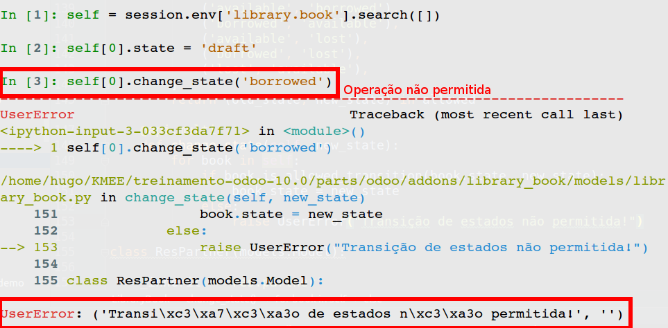
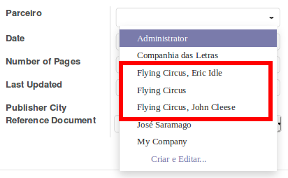

IPython
=======

Antes de começarmos essa seção, vamos aprender a instalar e utilizar uma nova ferramenta de desenvolvimento, o IPython.

Atualizando o buildout
----------------------
Altere o arquivo buildout.cfg adicionando o seguinte código

.. code-block:: shell

   [odoo]
   ...
   eggs = ...
       ipython

   odoo_scripts =
       ipython command-line-options=-d arguments=user_ns=dict(session=session)

   [versions]
   ...
   ipython = 5.3.0

Executando o buildout
---------------------
Execute novamente o buildout

.. code-block:: shell

    $ bin/buildout -N

Preparando o IPython
--------------------

No terminal, inicie o IPython:

.. code-block:: shell

    bin/ipython_odoo -d dbname --

Após isso, vamos buscar nosso módulo pelo IPython:

.. code-block:: shell
   
    In [1]: library = session.env['library.book']

    In [2]: self = library.search([])
 
    In [3]: self 
    Out[3]: library.book[1, 2, 3, ...]  

Revisão
========

Model
-----

- Model é uma representação de um objeto de negócio, eles podem ser persistentes, não persistentes e abstratos:

.. code-block:: python

    class MeuModeloPersistente(models.Model):
        ...
    class MeuModeloAbstrato(models.AbstractMethod):
        ...
    class MeuModeloNaoPersistente(models.TransientMethod):
        ...

.. nextslide::

- Um model é uma classe Python! Que faz herança de uma das classes, como exemplificado acima, do arquivo 'parts/odoo/odoo/models.py' e é composta de atributos e métodos:
    - *Atributos especiais* iniciados com UNDERLINE _name, _rec_name etc;
    - Atributos derivados do módulo *fields* são do ORM e dependendo do tipo de modelo são campos salvos no banco de dados;
    - Quando o modelo é do tipo persistente o nome do atributo é o mesmo nome do campo no banco de dados!

.. code-block:: python

    class A(models.Model):
        _name ='a'
        valor = fields.Float(...)

Recordset
---------
- Um objeto Recordset representa os registros em uma tabela base ou os registros resultantes da execução de uma consulta.

- Quando métodos definidos em um modelo são executados o atributo **self** é um **recordset**.

.. code-block:: python

    def do_operation(self):
        print self # => a.model(1, 2, 3, 4, ...)
        for record in self:
            print record # => a.model(1), then a.model(2), then a.model(3), ...

No IPython:

.. code-block:: shell

    In [1]: for record in self:
       ...:     print record
       ...:    
    library.book(6,)
    library.book(8,)
    library.book(14,)
    ...

Acesso aos campos
-----------------

**Recordsets proveem um padrão denominado "Active-Record"**:

Em Engenharia de software, active record é um padrão de projeto encontrado em softwares que armazenam seus dados em Banco de dados relacionais. Assim foi nomeado por Martin Fowler em seu livro Patterns of Enterprise Application Architecture[1].

A interface de um certo objeto deve incluir funções como, por exemplo:

- Inserir(Insert) / Atualizar(Update) / Apagar(Delete);
- Propriedades que correspondam de certa forma diretamente às colunas do banco de dados associado.

.. nextslide::

Portanto, modelos podem ser escritos e lidos de forma direta através de um record.

Mas somente nos singletons(apenas uma instância de model) que setar um field dispara um update no banco de dados. 

Exemplo:

.. code-block:: python

    >>> record.name
    Example Name
    >>> record.company_id.name
    Company Name
    >>> record.name = "Bob"
    >>> record.do_operation()

IPython:

.. code-block:: shell

    In [1]: self[0].name
    Out[1]: u'Ensaio sobre a Cegueira'

Desenvolvimento Server Side
===========================

``Tópicos:``

* Definindo metódos de modelos e usando API decorators;
* Saída de erros para os usuários;
* Obtendo um recordset para um modelo diferente;
* Criando novas records;
* Update de valores de uma recordset;
* Procurando por registros;
* Combinando recordsets;

.. nextslide::

* Filtrando recordsets;
* Atravessando as relações de registros;
* Estendendo a lógica de negócios definida em um modelo;
* Estendendo os métodos de criação e alteração: write() e create();
* Customizando como os registros são procurados;

Introdução
----------
Quando falamos de Modelo de Aplicações, nós vimos como declarar ou estender
modelos em módulos customizados. As receitas deste capítulo abgrangem campos
calculados bem como métodos para restringir os valores dos campos.

Vamos focar nos conceitos básicos de desenvolvimento do lado servidor seguindo as
definições Odoo de métodos, manipulação de registros e estender metódos herdados.

Model methods & API Decorators
------------------------------
As classes de modelo podem conter:

- Campos para os dados personalizados, através da definição de fields;
- Comportamento personalizado através da definição de métodos da classe;

Vamos ver como escrever um método que pode ser chamado por um botão na interface
do usuário, ou por algum outro pedaço de código em nossa aplicação.

Este método irá atuar sobre LibraryBooks e executar as ações necessárias para
alterar o estado de uma seleção de livros.

.. nextslide::

Adicione o campo ``state`` no modelo LibraryBook como exibido abaixo:

.. literalinclude:: code/1.py
   :language: python
   :linenos:

.. nextslide::

Para definir um metódo na LibraryBook para permitir a mudança do estado de
uma seleção de livros, precisaremos adicionar o seguinte código na definição
do modelo:

1. Adicione um método auxiliar para verificar se a mudança de estado é permitido:

.. literalinclude:: code/2.py
   :language: python
   :linenos:

.. nextslide::

2. Adicione um método para alterar o estado de alguns livros para um
novo passado como um argumento:

.. literalinclude:: code/3.py
   :language: python
   :linenos:

.. nextslide::

Definimos dois métodos:

- Eles são métodos Python comuns, tendo self como argumento, mas também podem ter argumentos adicionais.
- Os métodos são decorados com **decorators** definidos em odoo.api

.. nextslide:: 

Testando os métodos definidos anteriormente:

.. code-block:: shell

    In [1]: self[0].state = 'draft' #Definindo o estado do livro como 'draft'

    In [2]: self[0].is_allowed_transition('draft','borrowed') #Verificando se transição de estado é possível
    Out[2]: False #Não é possível

    In [3]: self[0].is_allowed_transition('draft','available') #Verificando se transção de estado é possível
    Out[3]: True #É possível

    In [4]: self[0].change_state('borrowed')

    In [5]: self[0].state #Verificando se o estado foi alterado
    Out[5]: 'draft'  #O estado não foi alterado por não ser possível

    In [6]: self[0].change_state('available')

    In [7]: self[0].state #Verificando se o estado foi alterado
    Out[7]: 'available' #O estado foi alterado com sucesso

Para que as alterações no banco sejam persistidas:

.. code-block:: shell

    In [8]: session.cr.commit()

    

Environment
-----------

- self.env.cr : Database cursor (cr.commit(), cr.execute(sql), etc..)
- self.env.user : Usuário que fez a chamada, que esta interagindo com o sistema.
- self.env.context : É o contexto, um dicionário python, contendo diversas informações como:
    - Linguagem do usuário;
    - Timezone
    - E outras chaves específicas definidas em tempo de execução através da interface de usuário

Saída de erros para os usuários
-------------------------------

Como apresentar uma mensagem amigável ao usuário quando quando ocorrer um erro

* *Alertando o usuário*: Se a transição de estados não for permitida, deve-se lançar uma mensagem de erro.

.. literalinclude:: code/4.py
   :language: python
   :linenos:

.. nextslide::

1. Adicione o seguinte import no início do arquivo python

.. literalinclude:: code/5.py
   :language: python
   :linenos:

2. Modifique o metódo para gerar uma mensagem de erro:

.. literalinclude:: code/6.py
   :language: python
   :linenos:

.. nextslide:: 

Testando o método com tratamento de erro:

Obtendo um recordset para um modelo diferente
---------------------------------------------

Quando escrevemos código para o Odoo, os metódos do modelo atual são chamados via self.
Não é possível instânciar diretamente uma classe de um modelo diferente.

Para isso, vamos escrever um pequeno método no modelo library.book buscando todas os
library.members.

.. nextslide::
1. Na classe LibraryBooks, escreva um metódo chamado  get_all_library_members:

.. literalinclude:: code/7.py
   :language: python
   :linenos:

2. No corpo do método, use o seguinte código:

.. literalinclude:: code/8.py
   :language: python
   :linenos:

Criando novas records
---------------------

Criando registros para popular a tabela de parceiros.
Vamos criar o representante de uma empresa com alguns contatos.

Primeiro, adicione os seguintes campos na classe ResPartner:

.. literalinclude:: code/9.py
   :language: python
   :linenos:

.. nextslide::

Ainda na classe ResPartner, siga os procedimentos:

0. Crie um método create_contacts():

.. literalinclude:: code/50.py
   :language: python
   :linenos:

1. Dentro do método, recupere a data formatada com string
como esperado pelo método create():

.. literalinclude:: code/10.py
   :language: python
   :linenos:

2. Prepare o dict que conterá os dados do primeiro contato.

.. literalinclude:: code/11.py
   :language: python
   :linenos:

.. nextslide::

3. Prepare o dict que conterá os dados do segundo contato.

.. literalinclude:: code/12.py
   :language: python
   :linenos:

4. Prepare o dict com os valores dos campos da empresa.

.. literalinclude:: code/13.py
   :language: python
   :linenos:

.. nextslide::

5.Chame o método create para criar o novo registro.

.. literalinclude:: code/14.py
   :language: python
   :linenos:

Quando o método create() é chamado no passo 5, três registros são criados:

* Um para o parceiro principal - a empresa - , quando retornado por *create*
* Um para cada um dos 2 contatos, quando disponível em record.child_ids

.. nextslide::

Testando o código:

.. code-block:: shell

    In [1]: session.env['res.partner'].create_contacts()

    In [2]: session.cr.commit()

O resultado pode ser visto na interface do Odoo, no cadastro de novos livros:

Update de valores de uma recordset
----------------------------------

A lógica de negócios muitas vezes implica na atualização de registros, 
alterando os valores de alguns dos seus campos.

Veremos como adicionar um contato de um parceiro e modificar o campo 
data do parceiro.

Para atualizar um parceiro, escreva um novo método chamado add_contacts() na classe ResPartner como este:

Opção 1:

.. literalinclude:: code/15.py
   :language: python
   :linenos:

.. nextslide::

Opção 2:

.. literalinclude:: code/16.py
   :language: python
   :linenos:

Procurando por registros
------------------------
Procurar por registros é uma opção comum nas operações do negócio.
Vamos ver como procurar um parceiro (empresa) e seus contatos pelo *nome da empresa*

1. Obtenha um conjunto de registros vazios do res.partner

.. literalinclude:: code/17.py
   :language: python
   :linenos:

.. nextslide::

2. Escreva seu critério para o domínio de busca:

.. literalinclude:: code/18.py
   :language: python
   :linenos:

3. Chame o método search() com o domínio e retorne o recordset:

.. literalinclude:: code/19.py
   :language: python
   :linenos:

Combinando recordsets
---------------------

As vezes você vai encontrar registros que não são exatamente o que você precisa.

Supported Operations RecordSet also support set operations you can add, union and intersect, ... recordset:

.. literalinclude:: code/20.py
   :language: python
   :linenos:

Filtrando recordsets
--------------------

1. Defina o método de aceitar o conjunto de registros original:

2. Defina uma função interna:

3. Chame o método filter()

.. literalinclude:: code/21.py
   :language: python
   :linenos:

Atravessando as relações de registros
-------------------------------------

1.	 Crie um método chamado get_email_addresses().
2.	 Chame o método mapped() para retornar todos os e-mails de contatos dos parceiros.
3.	 Crie um método chamado get_companies()
4.	 Chame o método mapped() para retornar as empresas dos parceiros

.. literalinclude:: code/22.py
   :language: python
   :linenos:

Alterando comportamentos já definidos através de outros módulos
---------------------------------------------------------------

Quando definimos um modelo que estende outro modelo,
muitas vezes é necessário personalizar o comportamento de alguns
métodos definidos no modelo original.

Esta é uma tarefa muito fácil no Odoo.

**É um dos recursos mais poderosos do quadro framework.**

.. nextslide::

Crie um novo módulo adicional: **library_load_return_date** que
depende do **library.book**

Download do módulo já criado: :download:`library_load_return_date.zip <code/library_load_return_date.zip>`

Aqui será dada apenas uma explicação não-funcional, a funcionalidade será praticada no próximo arquivo de Slides.

.. nextslide::

No novo módulo criado(models/library_book_load.py), estenda o modelo library.book:

.. literalinclude:: code/23.py
   :language: python
   :linenos:

.. nextslide::

Em library_load_return_date, defina o método _compute_age como a seguir:

.. literalinclude:: code/26.py
   :language: python
   :linenos:

Isso fará com que livros cuja 'idade' seja '0', passem a ter idade '-1'.

Estendendo write() e create()
-----------------------------

Iremos estender os métodos write() e create() para controlar o acesso de alguns campos de registros.

Modifique o arquivo security/ir.model.access.csv para permitir o acesso dos usuários aos livros.

.. literalinclude:: code/27.csv
   :language: csv
   :linenos:

.. nextslide::

Adicione o campo manager_remarks no modelo library.book. Nós precisamos somente que os grupo
Library Managers tenham privilégios para escrever nos campos.

.. literalinclude:: code/28.py
   :language: python
   :linenos:

.. nextslide::

Para prevenir que usuários que não fazem parte do grupo "Library Managers" modifiquem o valor 
de *manager_remarks*, vamos modificar o seguinte:

1. estender o método create()
2. estender o método write()
3. estender o método fields_get()

.. nextslide::

.. literalinclude:: code/29.py
   :language: python
   :linenos:

*continua*

.. nextslide::

.. literalinclude:: code/30.py
   :language: python
   :linenos:

.. Customizando como os registros são procurados
.. ---------------------------------------------
