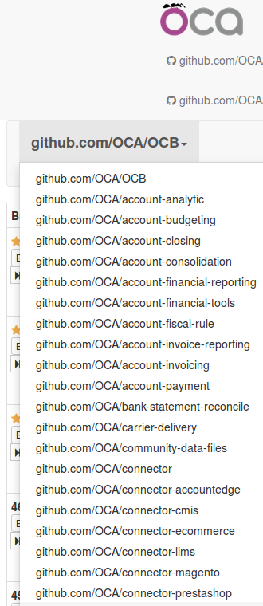
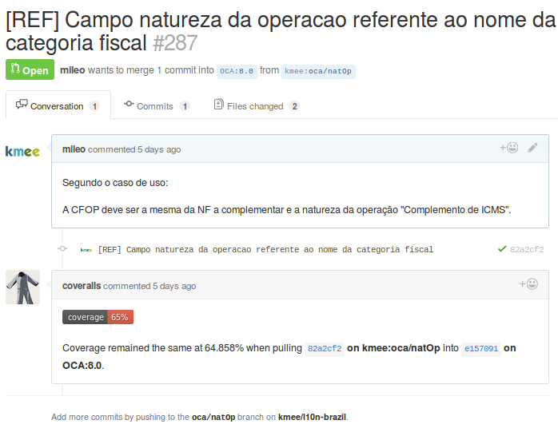
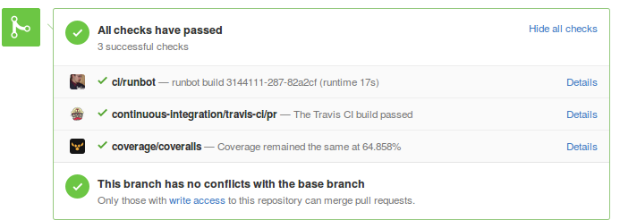
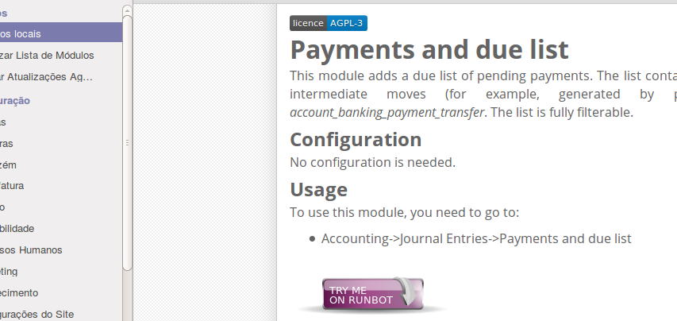

Community Paterns
=================

Criando um novo repositorio
---------------------------
To initialize the branches on the Github repository, locally run the following commands:
.. code::

    export REPO=name_of_the_repo
    mkdir $REPO
    cd $REPO
    git init

Then, for each branch run:
.. code::

    export BRANCH=8.0
    git checkout -b $BRANCH

Create README, .travis.yml, .gitignore... using https://github.com/OCA/maintainer-quality-tools/tree/master/sample_files as a starting point

.. code::

    git add .
    git commit
    git remote add origin git@github.com:OCA/$REPO
    git push origin $BRANCH:$BRANCH

.. nextslide::

oca_dependencies.txt

.. code::

    # List the OCA project dependencies, one per line
    # Add a repository url and branch if you need a forked version
    #
    # Examples
    # ========
    #
    # To depend on the standard version of sale-workflow, use:
    # sale-workflow
    #
    # To explicitely give the URL of a fork, and still use the version specified in
    # .travis.yml, use:
    # sale-workflow https://github.com/OCA/sale-workflow
    #
    # To provide both the URL and a branch, use:
    # sale-workflow https://github.com/OCA/sale-workflow branchname

Activate Transifex
------------------
First read this to understand how it works : https://github.com/OCA/maintainer-quality-tools/pull/186#issue-74411066

Then:

1. Create a PR to change the .travis.yml and readme.md file
2. Refer to this .travis.yml sample page here : https://github.com/OCA/maintainer-quality-tools/blob/master/sample_files/.travis.yml#L26

.. nextslide::

3. Take the proper token here : https://github.com/OCA/maintainer-quality-tools/issues/194#issue-79502151
4. Tick your project here : https://github.com/OCA/maintainer-quality-tools/issues/194#issuecomment-107912200

Finally, update the readme.md at the root of your repository to add the translation status:

.. code::

    []
                        (https://www.transifex.com/projects/p/OCA-social-8-0)

Continuous Integration - Runbot
-------------------------------
The OpenERP Runbot (or simply runbot) is a program monitoring and running branches on Github belonging to the different Odoo projects.

It is available at http://runbot.odoo.com and is a constantly up to date server running Odoo for testing and demo purposes.

Several of the latest builds of the Odoo branches (6.0, 6.1, 7.0, 8.0, 9.0, saas and trunk) as well as development and testing branches are available.

.. nextslide::

You log in with:

- admin/admin
- demo/demo

There are generally two databases available

- 'all' (every module installed with demo data)
- 'base' (no modules installed).

.. nextslide::

The home page of runbot shows green and red lights to indicate a build works (green) or doesn't work (red).

Hover over any branch with a RED indicator, and you will see a gear icon. Click it and select "Install Logs (error)".
You will then be able to see a detailed logfile indicating what failed.

.. image:: images/runbot.png
    :align: right

Several logs indicating what happened during the build attempt will be available:

OCA - CI Tools - Runbot
-----------------------
OCA runbot is also available at http://runbot.odoo-community.org/

- One runbot per project;

.. nextslide::

- Build status in github PR

.. nextslide::

All PR:

- Flake8 / Manteiner Quality Tools
- OCB Tests
- Odoo Tests

.. nextslide::

- Try module link on module description:

Outros
======

Chamar o método onchange no lado do servidor
--------------------------------------------

.. nextslide::

1. Crie o método terun_all_books na classe LibraryMember:

.. code-block:: python

    @api.multi
    def return_all_books(self):
        self.ensure_one

2. Retorno um valor vazio para library.returns.wizard:

.. code-block:: python

        wizard = self.env['library.returns.wizard']

3. Prepare os valores para criar um novo registro no wizard:

.. code-block:: python

        values = {'member_id': self.id, book_ids=False}

.. nextslide::

4. Recuperar as especificações onchange para o wizard:

.. code-block:: python

        specs = wizard._onchange_spec()

5. Recupere o resultado do método onchange:

.. code-block:: python

        updates = wizard.onchange(values, ['member_id'], specs)

6. Mescle o resultado com os valores do novo wizard:

.. code-block:: python

        value = updates.get('value', {})
        for name, val in value.iteritems():
        if isinstance(val, tuple):
            value[name] = val[0]
        values.update(value)

.. nextslide::

7. Crie o wizard:

.. code-block:: python

        record = wizard.create(values)
