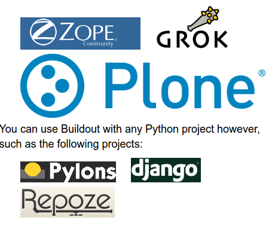

Buildout
========

O que é?
--------

Buildout é um sistema de *build* baseado em Python para a criação, montagem e
implantação de aplicativos de com vários componentes.

Alguns dos quais não são necessáriamente baseados em Python.

Ele permite você criar uma "receita" e replicar o mesmo software posteriormente.

Quem?
-----

Odoo buildout recipe
--------------------

- O Buildout odoo foi criado pela Anybox;
- https://github.com/anybox/anybox.recipe.odoo
- Permite definir e rapidamente realizar o deploy de qualquer versão do Odoo.
- De ambientes de desenvolvimento a até automatização completa de ambientes de produção com integração continua.
- Uniformidade entre versões;
- Obtenção de modulos odoo de diferentes fontes: git, brz, svn etc;
- Capacidade de versionar tudo para repetibilidade;
- Gerenciamento da configuração do ODoo
- Empacotamento: Criação de pacotes para facil deploy em ambientes controlados.

Como funciona?
--------------

- Uma configuração pode extender outra e até alterar configurações já definidas
- Podemos definir variáveis para especificar configurações
- [versions] sessão padrão utilizada para versionar os pacores python
- Você pode gerenciar a configuração através de um sistema de controle de versão.

.. nextslide::

- O código fonte do odoo fica no diretório parts/subdiretório
- As dependencias python em eggs/
- O arquivo de configuração é criado na pasta etc/odoo.cfg
- Um script para inicialização do Odoo é criado em bin/start_odoo

Instalando o Odoo c/ Buildout
-----------------------------

1. Criação de um novo diretório
2. Download / Criação dos arquivos de configuração ( receitas ), **common.cfg**
3. Copia do modelo buildout.cfg.in -> buildout.cfg
4. Alteração do mesmo com nossas configurações locais.
5. Execução do init.sh
6. bin/buildout -N

Adicioanndo novos repositósios
------------------------------

Exercicio.

Merges temporários
------------------

Durante o desenvolvimento pode ser preciso unir códigos c/ diferentes versões e que ainda não foram integrados ao codigo principal.

.. code-block:: shell

    [odoo]
    OCA = https://github.com/OCA
    version = git https://github.com/odoo/odoo.git odoo 8.0 depth=1
    addons = git ${odoo:OCA}/partner-contact.git parts/partner-contact 8.0
    git ${odoo:OCA}/product-attribute.git parts/product-attribute 8.0

    merges = git origin parts/partner-contact pull/237/head
        git origin parts/partner-contact pull/249/head
        git origin parts/product-attribute pull/132/head

Adionando uma dependencia python de um addon
--------------------------------------------

Se um modulo odoo precisa de um pacote python externo, você pode adiciona-lo na
sessão [odoo] e versiona-lo na sessão [versions] conforme:

.. code-block:: shell

    [odoo]
    eggs += unicodecsv
    [versions]
    unicodecsv = 0.14.1

Congelando um buildout
----------------------

Para facilitar a implantação, podemos utilizar a opção freeze-to para gerar uma
configuração buildout que congela todas as revisões do Odoo e seus addons:

.. code-block:: shell

    bin/buildout -c prod.cfg -o odoo:freeze-to=frozen-prod.cfg

Você pode então executar buildout com o arquivo de frozen-prod.cfg para obter as mesmas versões exatas dos arquivos.

Mais informações
----------------

- http://pythonhosted.org/anybox.recipe.odoo/